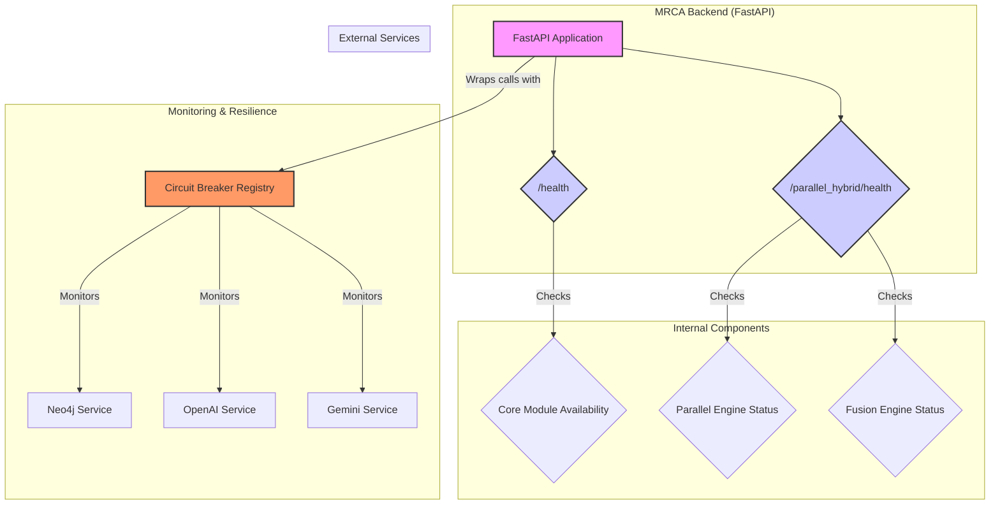
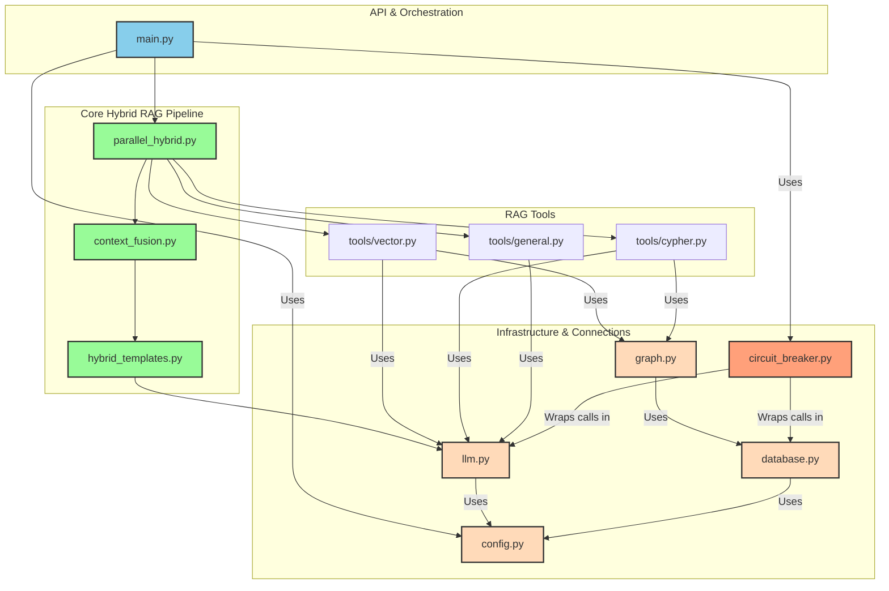
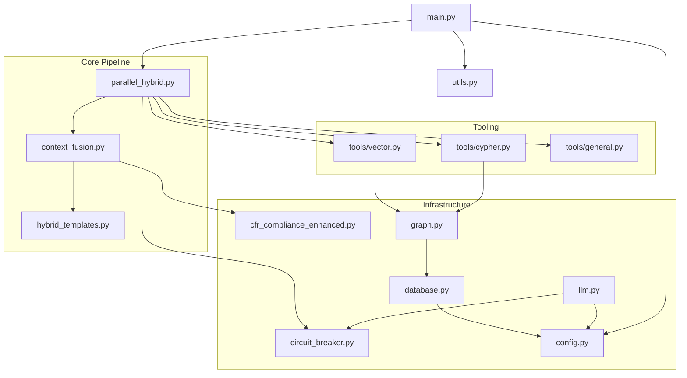

# MRCA Documentation

---

## Mining Regulatory Compliance Assistant - Advanced Parallel Hybrid - Intelligent Fusion System

---

**Author:** Alexander Ricciardi  
**Project:** MRCA - Mining Regulatory Compliance Assistant  
**Version:** beta 2.0.0   
**Last Updated:** July 2025  

© 2025 Alexander Samuel Ricciardi - Mining Regulatory Compliance Assistant  
License: Apache-2.0 | Technology: Advanced Parallel HybridRAG - Intelligent Fusion System

---

This document was created by a human with the help of generative AI.

---

# Table of Contents

## MRCA Documentation Overview

- [🎯 **Executive Summary**](#-executive-summary)
  - [Core Innovation: Advanced Parallel HybridRAG Technology](#core-innovation-advanced-parallel-hybridrag-technology)

- [🏗️ **System Architecture**](#️-system-architecture)
  - [Microservices Backend-for-Frontend (BFF) Architecture](#microservices-backend-for-frontend-bff-architecture)
  - [Advanced Parallel HybridRAG Processing Pipeline](#advanced-parallel-hybridrag-processing-pipeline)

- [🔬 **Core Technology Components**](#-core-technology-components)
  - [1. Parallel Retrieval Engine (`backend/parallel_hybrid.py`)](#1-parallel-retrieval-engine-backendparallel_hybridpy)
  - [2. Context Fusion Engine (`backend/context_fusion.py`)](#2-context-fusion-engine-backendcontext_fusionpy)
  - [3. HybridRAG Template System (`backend/Hybrid_templates.py`)](#3-hybridrag-template-system-backendhybrid_templatespy)

- [🗄️ **Knowledge Base Architecture**](#️-knowledge-base-architecture)
  - [Neo4j HybridRAG Knowledge Store Structure](#neo4j-hybridrag-knowledge-store-structure)
  - [Neo4j AuraDB Hybrid Database Architecture: Managing Graph and Vector Data](#neo4j-auradb-hybrid-database-architecture-managing-graph-and-vector-data)
    - [Technical Implementation of Dual Data Storage](#technical-implementation-of-dual-data-storage)
    - [Vector Index Implementation Details](#vector-index-implementation-details)
    - [Advanced Parallel HybridRAG Query Execution](#advanced-parallel-hybridrag-query-execution)
    - [Performance Optimization Features](#performance-optimization-features)
    - [Technical Advantages of Unified Storage](#technical-advantages-of-unified-storage)
    - [MRCA-Specific Implementation](#mrca-specific-implementation)

- [🛠️ **RAG Tools Implementation**](#️-rag-tools-implementation)
  - [VectorRAG Tool (`backend/tools/vector.py`)](#vectorrag-tool-backendtoolsvectorpy)
  - [GraphRAG Tool (`backend/tools/cypher.py`)](#graphrag-tool-backendtoolscypherpy)
  - [General Tool (`backend/tools/general.py`)](#general-tool-backendtoolsgeneralpy)

- [🎨 **User Interface Architecture**](#-user-interface-architecture)
  - [Frontend Service (`frontend/bot.py`)](#frontend-service-frontendbotpy)

- [📊 **Data Processing Pipeline**](#-data-processing-pipeline)
  - [Data Collection (`build_data/cfr_downloader.py`)](#data-collection-build_datacfr_downloaderpy)
  - [Knowledge Graph Construction (`build_data/build_Hybrid_store.py`)](#knowledge-graph-construction-build_databuild_hybrid_storepy)

- [⚙️ **Configuration and Infrastructure**](#️-configuration-and-infrastructure)
  - [Configuration System (`backend/config.py`)](#configuration-system-backendconfigpy)
  - [Security Implementation](#security-implementation)
  - [Fault Tolerance and Reliability](#fault-tolerance-and-reliability)

- [🐳 **Deployment and Infrastructure**](#-deployment-and-infrastructure)
  - [Docker Containerization (`docker-compose.yml`)](#docker-containerization-docker-composeyml)
  - [Health Monitoring](#health-monitoring)

- [📁 **Complete File Structure**](#-complete-file-structure)
  - [📋 PROJECT INFRASTRUCTURE & DEPLOYMENT](#-project-infrastructure--deployment)
  - [🎨 FRONTEND SERVICE (Streamlit UI - Port 8501)](#-frontend-service-streamlit-ui---port-8501)
  - [🧠 BACKEND SERVICE (FastAPI API - Port 8000)](#-backend-service-fastapi-api---port-8000)
  - [🏭 DATA PROCESSING PIPELINE](#-data-processing-pipeline)
  - [📊 REGULATORY DATA STORAGE](#-regulatory-data-storage)
  - [📚 DOCUMENTATION & ARCHITECTURE](#-documentation--architecture)
  - [🔧 GLOBAL CONFIGURATION](#-global-configuration)
  - [📈 SYSTEM MONITORING & LOGS](#-system-monitoring--logs)

- [🚀 **Technology Stack**](#-technology-stack)
  - [Core Technologies](#core-technologies)
  - [Advanced Components](#advanced-components)
  - [Development Tools](#development-tools)

- [🎯 **Key Performance Metrics**](#-key-performance-metrics)
  - [Knowledge Base Scale](#knowledge-base-scale)
  - [Processing Performance](#processing-performance)
  - [System Reliability](#system-reliability)

- [🏆 **Architectural Achievements**](#-architectural-achievements)
  - [Technical Innovation](#technical-innovation)
  - [Mining Industry Impact](#mining-industry-impact)
  - [Research Contributions](#research-contributions)
  - [Software Engineering Excellence](#software-engineering-excellence)

- [📞 **Quick Start Guide**](#-quick-start-guide)
  - [Prerequisites](#prerequisites)
  - [Launch Application](#launch-application)
  - [Access Application](#access-application)
  - [Configuration](#configuration)

- [📚 **Additional Resources**](#-additional-resources)
  - [Documentation Files](#documentation-files)

- [🚀 **Application Launchers**](#-application-launchers)
  - [Simple Detached Launcher (`start_services.py`)](#simple-detached-launcher-start_servicespy)
  - [Advanced Dev Container Launcher (`launch_devcontainer.py`)](#advanced-dev-container-launcher-launch_devcontainerpy)
  - [Service Stopper (`stop_services.py`)](#service-stopper-stop_servicespy)
  - [Connection Issue Prevention](#connection-issue-prevention)
  - [Architecture Diagrams](#architecture-diagrams)
  - [Reference Materials](#reference-materials)

- [🔄 **Version History**](#-version-history)

- [🔢 **Advanced Scoring System: Detailed Implementation Analysis**](#-advanced-scoring-system-detailed-implementation-analysis)
  - [Overview of MRCA's Scoring Architecture](#overview-of-mrcas-scoring-architecture)
  - [1. Individual Retrieval Confidence Scores](#1-individual-retrieval-confidence-scores)
    - [Vector Retrieval Confidence Calculation](#vector-retrieval-confidence-calculation)
    - [Graph Retrieval Confidence Calculation](#graph-retrieval-confidence-calculation)
  - [2. Advanced Context Fusion Scoring](#2-advanced-context-fusion-scoring)
    - [Complementarity Score (Jaccard Similarity)](#complementarity-score-jaccard-similarity)
    - [Regulatory Quality Score](#regulatory-quality-score)
    - [Adaptive Weight Calculation](#adaptive-weight-calculation)
  - [3. Advanced Fusion Confidence Calculation](#3-advanced-fusion-confidence-calculation)
  - [4. Overall Quality Score Calculation](#4-overall-quality-score-calculation)
    - [Content Characteristics Analysis](#content-characteristics-analysis)
  - [5. Enhanced Regulatory Quality Analysis](#5-enhanced-regulatory-quality-analysis)
  - [6. Fusion Strategy Implementation](#6-fusion-strategy-implementation)
    - [Weighted Linear Fusion](#weighted-linear-fusion)
    - [Max Confidence Fusion](#max-confidence-fusion)
    - [Advanced Hybrid Fusion](#advanced-hybrid-fusion)
  - [7. Template-Level Confidence Integration](#7-template-level-confidence-integration)
  - [8. Scoring System Integration and Data Flow](#8-scoring-system-integration-and-data-flow)
  - [Technical Implementation Benefits](#technical-implementation-benefits)

- [❤️ **Health Monitoring and Fault Tolerance**](#️-health-monitoring-and-fault-tolerance)
  - [Health Monitoring Architecture](#health-monitoring-architecture)
  - [1. API Health Endpoints (`backend/main.py`)](#1-api-health-endpoints-backendmainpy)
    - [`/health` (Basic Health Check)](#health-basic-health-check)
    - [`/parallel_hybrid/health` (Detailed Component Health Check)](#parallel_hybridhealth-detailed-component-health-check)
  - [2. Circuit Breaker System for Fault Tolerance (`backend/circuit_breaker.py`)](#2-circuit-breaker-system-for-fault-tolerance-backendcircuit_breakerpy)
    - [Circuit Breaker States](#circuit-breaker-states)
    - [Integration](#integration)
  - [Graceful Degradation](#graceful-degradation)

- [🧠 **Backend Architecture: A Deep Dive**](#-backend-architecture-a-deep-dive)
  - [Component Interaction Diagram](#component-interaction-diagram)
  - [1. Infrastructure and Connections Layer](#1-infrastructure-and-connections-layer)
  - [2. Advanced Parallel Hybrid Core Layer](#2-advanced-parallel-hybrid-core-layer)
  - [3. API and Orchestration Layer](#3-api-and-orchestration-layer)

- [📂 **Backend Code Overview**](#-backend-code-overview)
  - [⚙️ Configuration & Infrastructure](#-configuration--infrastructure)
  - [🔬 Core Hybrid RAG Pipeline](#-core-hybrid-rag-pipeline)
  - [🎯 API & Orchestration](#-api--orchestration)
  - [🛠️ RAG Tooling (`backend/tools/`)](#-rag-tooling-backendtools)

---

---

## 🎯 **Executive Summary**

MRCA (Mining Regulatory Compliance Assistant) is a cutting-edge AI-powered web application that provides quick, reliable, and easy access to MSHA (Mine Safety and Health Administration) regulations using natural language queries. Built on groundbreaking **Advanced Parallel Hybrid** technology, MRCA represents a significant leap forward in regulatory compliance assistance for the mining industry.

### **Core Innovation: Advanced Parallel HybridRAG Technology**

Unlike traditional RAG (Retrieval Augmented Generation) systems that use *sequential* processing, MRCA implements **simultaneous VectorRAG and GraphRAG execution** with intelligent context fusion:

- **Traditional RAG**: `if condition: vector_search() else: graph_search()` (sequential)
- **MRCA's Innovation**: `asyncio.gather(vector_task, graph_task)` (true parallelism)

This approach combines:
- **🔍 VectorRAG**: Semantic similarity search using 768-dimensional Gemini embeddings
- **🕸️ GraphRAG**: Knowledge graph traversal with automated Cypher generation
- **🧠 Context Fusion**: Intelligent combination using 4 research-based fusion strategies
- **📝 Hybrid Templates**: 5 specialized response templates for different use cases

---

---

## 🏗️ **System Architecture**

### **Microservices Backend-for-Frontend (BFF) Architecture**

```
┌─────────────────┐    HTTP/REST     ┌─────────────────┐
│   Frontend      │ ◄──────────────► │   Backend       │
│   (Streamlit)   │                  │   (FastAPI)     │
│   Port 8501     │                  │   Port 8000     │
└─────────────────┘                  └─────────────────┘
                                              │
                                              ▼
                                     ┌─────────────────┐
                                     │   Neo4j Aura    │
                                     │   (Cloud DB)    │
                                     └─────────────────┘
```

### **Advanced Parallel HybridRAG Processing Pipeline**

```
┌───────────────────────────────────────────────┐
│  Step 1: Parallel Retrieval Engine            │
│  ┌─────────────────┐    ┌─────────────────┐   │
│  │   VectorRAG     │    │    GraphRAG     │   │
│  │ (async thread)  │    │ (async thread)  │   │
│  └─────────────────┘    └─────────────────┘   │
│                                │              │
│  Step 2: Context Fusion Engine                │
│  ┌─────────────────────────────────────────┐  │
│  │  4 Fusion Strategies + Quality Analysis │  │
│  └─────────────────────────────────────────┘  │
│                                │              │
│  Step 3: Hybrid Template System               │
│  ┌─────────────────────────────────────────┐  │
│  │  5 Template Types + Response Generation │  │
│  └─────────────────────────────────────────┘  │
└───────────────────────────────────────────────┘
```

---

---

## 🔬 **Core Technology Components**

### **1. Parallel Retrieval Engine (`backend/parallel_hybrid.py`)**

**Purpose**: Implements the revolutionary **Advanced Parallel HybridRAG** approach that executes VectorRAG and GraphRAG simultaneously.

**Key Innovation**: True parallel execution vs. sequential processing:
```python
# Traditional RAG (sequential)
if agent_chooses_vector:
    result = vector_search(query)
else:
    result = graph_search(query)

# MRCA's Advanced Parallel HybridRAG (simultaneous)
vector_task = asyncio.create_task(self._async_vector_retrieve(query))
graph_task = asyncio.create_task(self._async_graph_retrieve(query))
vector_result, graph_result = await asyncio.gather(vector_task, graph_task)
```

**Features**:
- True parallel execution using asyncio and ThreadPoolExecutor
- Advanced confidence scoring algorithms
- Alternative query strategies for failed retrievals
- Timeout handling and error recovery
- 35KB of sophisticated implementation code

### **2. Context Fusion Engine (`backend/context_fusion.py`)**

**Purpose**: Implements sophisticated fusion algorithms for intelligently combining VectorRAG and GraphRAG results.

**Four Fusion Strategies**:

1. **Weighted Linear Fusion** (Basic approach)
   - Dynamic weight calculation based on confidence scores
   - Simple mathematical averaging with adaptive weighting
   - Default weights: Vector (0.6), Graph (0.4)

2. **Max Confidence Selection** (Winner-takes-most)
   - Chooses the most confident result as primary (80%)
   - Adds secondary context for completeness (20%)
   - Best for scenarios with clear confidence differences

3. **Advanced HybridRAG Fusion** (Research-based - flagship)
   - Complementarity analysis using Jaccard similarity
   - MSHA-specific regulatory quality scoring
   - LLM-powered semantic coherence optimization
   - Multi-factor confidence calculation

4. **Adaptive Fusion** (Dynamic strategy selection)
   - Analyzes content characteristics in real-time
   - Routes to optimal strategy based on complexity analysis
   - Meta-algorithm that selects algorithms

**Advanced Features**:
- Regulatory quality assessment with MSHA-specific terminology
- Semantic coherence optimization using LLM
- Complementarity analysis between sources
- 40KB of research-based algorithms

### **3. HybridRAG Template System (`backend/Hybrid_templates.py`)**

**Purpose**: Advanced prompt engineering component that transforms fused context into specialized, regulatory-focused responses.

**Five Template Types**:

1. **Regulatory Compliance** (Primary production template)
   - Mine-type awareness (underground coal, surface coal, metal/nonmetal)
   - Compliance focus analysis (equipment, safety, emergency, electrical)
   - Urgency assessment for safety-critical requirements
   - Enhanced CFR citation preservation

2. **Research-Based** (Academic and analysis template)
   - Explicit methodology documentation
   - Source attribution with fusion strategy details
   - Research framework following academic standards
   - Quality metrics integration

3. **Basic HybridRAG** (Development and testing template)
   - Simple combination without advanced processing
   - Development-friendly clear structure
   - Performance optimized for quick responses

4. **Comparative Analysis** (Multi-source analysis template)
   - Detailed source comparison and contribution breakdown
   - Fusion strategy documentation
   - Research transparency demonstration

5. **Confidence-Weighted** (Quality-calibrated template)
   - Response tone calibrated to confidence levels
   - Quality assessment integration
   - Uncertainty handling with appropriate caveats

**Critical Features**:
- CFR citation preservation with exact regulatory accuracy
- Dynamic content adaptation based on query characteristics
- Mining-specific intelligence and terminology recognition
- 41KB of specialized prompt engineering code

---

---

## 🗄️ **Knowledge Base Architecture**

### **Neo4j HybridRAG Knowledge Store Structure**

```
Document Nodes ──► Chunk Nodes ──► Entity Nodes
     │                │                 │
     │                │                 ▼
     │                ▼           [Relationships]
     │         [Vector Embeddings]      │
     │                │                 │
     ▼                ▼                 ▼
[Document Metadata] [Semantic Search] [Graph Traversal]
```

**Database Statistics**:
- **26,429 total nodes** in the knowledge graph
- **20,851 MSHA-specific entities** extracted by Google Gemini
- **5,575 text chunks** with 768-dimensional vector embeddings
- **3 CFR volumes** (Title 30 Parts 1-999) processed
- **Complete MSHA regulatory coverage** (11.3MB total)

**Node Types**:
- **Document Nodes**: PDF files (3 CFR volumes)
- **Chunk Nodes**: Text segments with dual functionality
  - Graph component: Entity relationships
  - Vector component: Gemini embeddings
- **Entity Nodes**: MSHA-specific regulatory entities (equipment, procedures, regulations)

### **Neo4j AuraDB Hybrid Database Architecture: Managing Graph and Vector Data**

Neo4j AuraDB provides a sophisticated **dual-storage architecture** that seamlessly manages both traditional graph data (nodes, relationships, properties) and high-dimensional vector embeddings within the same database instance. This unified approach enables MRCA's Advanced Parallel HybridRAG technology to perform both graph traversal queries and semantic vector searches simultaneously.

#### **Technical Implementation of Dual Data Storage**

**1. Native Vector Index Integration**
Neo4j AuraDB implements vector storage through its **native vector index** capability, which stores vector embeddings as node properties while maintaining full graph functionality:

```cypher
-- Creating a vector index for 768-dimensional embeddings
CREATE VECTOR INDEX chunkVector IF NOT EXISTS
FOR (c:Chunk) ON (c.embedding)
OPTIONS {indexConfig: {
  `vector.dimensions`: 768,
  `vector.similarity_function`: 'cosine'
}}
```

**2. Unified Node Architecture**
Each Chunk node in MRCA's knowledge graph contains both graph properties and vector embeddings:

```cypher
-- Example Chunk node with dual functionality
(:Chunk {
  id: "chunk_001",
  text: "MSHA regulation text...",
  document_id: "CFR-30-Vol1",
  page_number: 42,
  embedding: [0.1234, -0.5678, 0.9012, ...] // 768-dimensional vector
})-[:MENTIONS]->(:Entity {name: "ventilation_system"})
```

**3. Simultaneous Query Execution Architecture**
Neo4j AuraDB enables true parallel execution of graph queries and vector searches through its **multi-threaded query engine**:

- **Graph Traversal Thread**: Executes Cypher queries for relationship-based retrieval
- **Vector Search Thread**: Performs approximate nearest neighbor (ANN) search using HNSW algorithm
- **Query Coordinator**: Manages parallel execution and result fusion

#### **Vector Index Implementation Details**

**Storage Layer Architecture**:
Neo4j AuraDB uses a **hierarchical storage approach** where vector embeddings are stored alongside traditional graph data:

```
┌─────────────────────────────────────────────────────────────────┐
│                    Neo4j AuraDB Instance                        │
├─────────────────────────────────────────────────────────────────┤
│  Graph Storage Layer                Vector Storage Layer        │
│  ├─ Node Store                     ├─ Vector Index (HNSW)       │
│  ├─ Relationship Store             ├─ Embedding Properties      │
│  ├─ Property Store                 ├─ Similarity Functions      │
│  └─ Label Store                    └─ Index Maintenance         │
├─────────────────────────────────────────────────────────────────┤
│              Unified Query Engine                               │
│  ├─ Cypher Query Processor         ├─ Vector Query Processor    │
│  ├─ Graph Traversal Engine         ├─ ANN Search Engine         │
│  └─ Parallel Execution Coordinator                              │
└─────────────────────────────────────────────────────────────────┘
```

#### **Advanced Parallel HybridRAG Query Execution**

**1. Vector Similarity Search**
MRCA leverages Neo4j's native vector capabilities for semantic retrieval:

```cypher
-- Vector similarity search for relevant chunks
CALL db.index.vector.queryNodes(
  'chunkVector', 
  5, 
  $queryEmbedding
) YIELD node, score
RETURN node.text, score
ORDER BY score DESC
```

**2. Graph Traversal Search**
Simultaneously executes relationship-based queries for contextual information:

```cypher
-- Graph traversal for entity relationships
MATCH (c:Chunk)-[:MENTIONS]->(e:Entity)
WHERE e.name CONTAINS $entityName
MATCH (e)-[:RELATES_TO]->(related:Entity)
RETURN c.text, e.name, collect(related.name) as related_entities
```

**3. Hybrid Query Fusion**
Advanced queries can combine both approaches within a single Cypher statement:

```cypher
-- Combined vector and graph search
CALL db.index.vector.queryNodes('chunkVector', 10, $queryEmbedding) 
YIELD node as chunk, score
WHERE score > 0.8
MATCH (chunk)-[:MENTIONS]->(entity:Entity)
MATCH (entity)-[:PART_OF]->(regulation:Regulation)
RETURN chunk.text, entity.name, regulation.title, score
ORDER BY score DESC, regulation.importance DESC
LIMIT 5
```

#### **Performance Optimization Features**

**1. Memory Management**
Neo4j AuraDB optimizes memory usage through:
- **Page Cache Management**: Intelligently caches frequently accessed graph pages and vector index segments
- **Memory-Mapped Files**: Uses memory-mapped I/O for efficient vector access
- **Adaptive Caching**: Dynamically adjusts cache allocation between graph and vector operations

**2. Index Maintenance**
Vector indexes are maintained automatically with:
- **Incremental Updates**: New embeddings integrated without full index rebuilds
- **Background Optimization**: Periodic index rebalancing during low-usage periods
- **Consistency Guarantees**: ACID transactions ensure vector and graph data remain synchronized

**3. Query Optimization**
The query planner optimizes hybrid queries by:
- **Cost-Based Planning**: Determines optimal execution strategy based on data distribution
- **Index Utilization**: Automatically selects most efficient indexes for query patterns
- **Parallel Execution**: Coordinates simultaneous graph and vector operations

#### **Technical Advantages of Unified Storage**

**1. Data Consistency**
- **Transactional Integrity**: Vector embeddings and graph relationships updated atomically
- **ACID Compliance**: Full ACID properties maintained across both data types
- **Referential Integrity**: Ensures vectors always correspond to valid graph nodes

**2. Operational Efficiency**
- **Single Database Management**: No complex data synchronization between separate systems
- **Unified Backup/Recovery**: Single backup strategy covers both graph and vector data
- **Simplified Architecture**: Reduces infrastructure complexity and operational overhead

**3. Performance Benefits**
- **Locality of Reference**: Related graph and vector data stored physically close
- **Reduced Network Overhead**: No cross-system communication required
- **Optimized I/O Patterns**: Coordinated access patterns for both data types

#### **MRCA-Specific Implementation**

For MRCA's Advanced Parallel HybridRAG system, this unified architecture enables:

**Simultaneous Execution Pipeline**:
```python
async def parallel_hybrid_retrieve(self, query):
    # Both operations execute simultaneously on same Neo4j instance
    vector_task = asyncio.create_task(
        self._vector_search(query_embedding)
    )
    graph_task = asyncio.create_task(
        self._graph_traversal(query_entities)
    )
    
    # Results from same database, ensuring consistency
    vector_results, graph_results = await asyncio.gather(
        vector_task, graph_task
    )
    
    return self._fuse_results(vector_results, graph_results)
```

**Data Consistency Benefits**:
- Vector embeddings always reflect current text content
- Graph relationships remain synchronized with vectorized chunks
- No data staleness between separate vector and graph databases

**Resource Optimization**:
- Single connection pool manages all database operations
- Shared memory allocation between graph and vector operations
- Unified monitoring and performance tuning

This sophisticated dual-storage architecture positions Neo4j AuraDB as an ideal platform for Advanced Parallel HybridRAG applications, providing the performance, consistency, and operational simplicity required for production-grade systems like MRCA.

---

---

## 🛠️ **RAG Tools Implementation**

### **VectorRAG Tool (`backend/tools/vector.py`)**
- **Technology**: LangChain + Neo4j Vector Index + Gemini embeddings
- **Search Type**: Semantic similarity search (cosine similarity)
- **Index**: `chunkVector` with 768 dimensions
- **Features**: Regulatory context filtering, entity-aware retrieval
- **Configuration**: Top-5 retrieval with 0.7 similarity threshold

### **GraphRAG Tool (`backend/tools/cypher.py`)**
- **Technology**: GraphCypherQAChain + GPT-4o
- **Query Generation**: Natural language → Cypher conversion
- **Features**: MSHA-specific prompt engineering, CFR citation handling
- **Relationships**: Document hierarchies, entity connections

### **General Tool (`backend/tools/general.py`)**
- **Purpose**: Fallback guidance and domain boundary enforcement
- **Features**: Out-of-scope detection, MSHA domain restriction
- **Scope**: Mining safety, health, MSHA regulations only

---

## 🎨 **User Interface Architecture**

### **Frontend Service (`frontend/bot.py`)**

**Dual Processing Modes**:
1. **Traditional Agent Mode**: Sequential ReAct agent (legacy support)
2. **Advanced Parallel HybridRAG Mode**: Primary research-grade system

**Enhanced UI Features**:
- **Real-time Configuration**: Live fusion strategy and template selection
- **Performance Analytics**: Processing times, confidence scores, fusion analysis
- **System Health Monitoring**: Component-level status indicators
- **Modern Design**: Responsive dark theme with mining industry branding

**User Experience Flow**:
```
User Query → Mode Selection → Configuration → Processing → Results + Analytics
```

**Advanced Configuration Panel**:
- **Fusion Strategy Selection**: 4 available strategies with descriptions
- **Template Type Selection**: 5 specialized templates with use case guidance
- **Real-time Help Text**: Dynamic explanations based on selections
- **Educational Content**: Research-based explanations of technologies

**Performance Metrics Display**:
- **Total Processing Time**: End-to-end pipeline execution
- **Confidence Scores**: Algorithm confidence in accuracy and reliability
- **Quality Scores**: Overall response quality assessment
- **Fusion Analysis**: Vector vs Graph contribution percentages
- **Strategy Information**: Applied fusion algorithm and template details

---

---

## 📊 **Data Processing Pipeline**

### **Data Collection (`build_data/cfr_downloader.py`)**
- **Source**: Title 30 CFR PDFs from GovInfo.gov
- **Content**: 3 volumes (Parts 1-199, 200-699, 700-999)
- **Format**: Official PDF documents (11.3MB total)
- **Update**: Annual downloads with version tracking

### **Knowledge Graph Construction (`build_data/build_Hybrid_store.py`)**

**Advanced Processing Pipeline**:
1. **PDF Text Extraction**: PyPDF2-based content extraction
2. **Intelligent Chunking**: RecursiveCharacterTextSplitter (2000 chars, 200 overlap)
3. **Parallel Processing**: Gemini entity extraction + vector embedding generation
4. **Graph Relationship Creation**: Entity connection mapping
5. **Vector Index Construction**: Neo4j vector index with 768-dimensional embeddings

**Processing Capabilities**:
- **Entity Extraction**: MSHA-specific mining terminology using Google Gemini
- **Embedding Generation**: Google Gemini 768-dimensional vectors
- **Batch Processing**: 10 chunks per batch with rate limiting
- **Quality Control**: Validation and error handling throughout pipeline

---

---

## ⚙️ **Configuration and Infrastructure**

### **Configuration System (`backend/config.py`)**
- **Technology**: Pydantic settings with validation and automatic secrets loading
- **Sources**: Environment variables, Streamlit `secrets.toml` (optionally a local `.env`) with automatic initialization loading
- **Components**: Database, LLM, API, performance, security settings with persistent session optimization
- **Validation**: Comprehensive input validation and error handling
- **Auto-Loading**: Secrets automatically loaded during configuration initialization (`init_config()` calls `update_from_secrets()`)
- **Session Persistence**: Extended timeouts for 24-hour sessions and 1-hour keep-alive connections

### **Security Implementation**
- **Environment Variables**: API key management via environment variables
- **Streamlit Secrets**: Development secrets integration
- **Input Validation**: Pydantic models for request validation
- **CORS Middleware**: Secure cross-origin communication
- **Domain Restriction**: MSHA regulatory domain boundaries

### **Fault Tolerance and Reliability**

**Circuit Breaker System (`backend/circuit_breaker.py`)**:
- **Monitoring**: Neo4j, OpenAI, Gemini API connections
- **Features**: Failure thresholds, timeout management, recovery testing
- **Implementation**: 32KB of comprehensive reliability code

**Graceful Degradation**:
- **Safe Tool Getters**: Fallback functions with informative messages
- **Error Handling**: Component-level error handling with user-friendly messages
- **Session Persistence**: 24-hour conversation sessions with 1-hour keep-alive connections - no disconnection while frontend is active
- **Health Monitoring**: Real-time component status tracking

---

---

## 🐳 **Deployment and Infrastructure**

### **Docker Containerization (`docker-compose.yml`)**

**Services**:
- **mrca_frontend**: Streamlit UI (Port 8501)
  - Image: mrca-frontend
  - Health check: Streamlit core health endpoint
  - Dependencies: Streamlit, requests

- **mrca_backend**: FastAPI server (Port 8000)
  - Image: mrca-backend
  - Health check: Custom health endpoint
  - Dependencies: FastAPI, LangChain, OpenAI, Neo4j, Google Gemini

**Network Architecture**:
- **mrca-network**: Internal Docker network for service communication
- **External Connections**: Neo4j Aura cloud database
- **API Integration**: OpenAI GPT-4o and Google Gemini services

### **Health Monitoring**

**Comprehensive Health Checks**:
- **Frontend Health**: `/_stcore/health`
- **Backend Health**: `/health`
- **Advanced Parallel Hybrid Health**: `/parallel_hybrid/health`
- **Component Diagnostics**: Individual tool health checks
- **Database Connectivity**: Neo4j connection and query testing

**Application Launchers**:
- **`launch_app.py`**: Intelligent launcher with dependency checking (20KB)
- **`launch_devcontainer.py`**: Development container launcher (17KB)
- **Development Features**: Graceful shutdown, health status monitoring

---

---

## **File Structure (main files)**

```
MRCA/                                           # Advanced Parallel Hybrid System
│  # PROJECT INFRASTRUCTURE & DEPLOYMENT
├── requirements.txt                       # Root dependencies
├── docker-compose.yml                     # Microservices deployment 
├── start_services.py                      # Simple detached launcher (NEW v2.0.0) 
├── launch_devcontainer.py                 # Advanced Dev Container launcher v2.0.0 
├── stop_services.py                       # Service termination script (NEW v2.0.0) 
├── .gitignore                             # Version control configuration
│
├── FRONTEND SERVICE (Streamlit UI - Port 8501)
│   └── frontend/
│       ├── bot.py                             # Main chat interface - dual AI modes 
│       ├── __init__.py                        # Frontend package configuration
│       ├── requirements.txt                   # Frontend dependencies
│       ├── test_frontend.py                   # Frontend test suite 
│       ├── Dockerfile.frontend                # Frontend containerization 
│       └── .streamlit/
│           ├── config.toml                    # Streamlit theme and UI configuration
│           └── secrets.toml.template          # API keys template
│
├── BACKEND SERVICE (FastAPI API - Port 8000)
│   └── backend/
│       ├── CORE API & ORCHESTRATION
│       │   ├── main.py                        # FastAPI orchestration layer 
│       │   ├── __init__.py                    # Backend package exports 
│       │   ├── requirements.txt               # Backend dependencies
│       │   └── Dockerfile.backend             # Backend containerization 
│       │
│       ├── ADVANCED PARALLEL HYBRID CORE
│       │   ├── parallel_hybrid.py             # Parallel retrieval engine 
│       │   ├── context_fusion.py              # Advanced fusion algorithms 
│       │   └── hybrid_templates.py            # Specialized prompt templates 
│       │
│       ├── RAG TOOLS IMPLEMENTATION
│       │   └── tools/
│       │       ├── __init__.py                # Tools package
│       │       ├── vector.py                  # VectorRAG: Semantic search (Gemini)
│       │       ├── cypher.py                  # GraphRAG: Cypher generation (GPT-4o)
│       │       └── general.py                 # General MSHA guidance & fallbacks
│       │
│       ├── INFRASTRUCTURE & CONNECTIONS
│       │   ├── config.py                      # Pydantic configuration 
│       │   ├── llm.py                         # LLM connections (OpenAI + Gemini) 
│       │   ├── graph.py                       # Neo4j database connections 
│       │   ├── database.py                    # Enhanced database utilities 
│       │   └── utils.py                       # Backend utility functions 
│       │
│       ├── FAULT TOLERANCE & MONITORING
│       │   └── circuit_breaker.py             # Circuit breaker system 
│       │
│       └── COMPLIANCE & ENHANCEMENT
│           └── cfr_compliance_enhanced.py     # Enhanced CFR compliance 
│
├── DATA PROCESSING PIPELINE
│   └── build_data/
│       ├── __init__.py                        # Build data package
│       ├── README.md                          # Data processing documentation 
│       ├── cfr_downloader.py                  # CFR PDF download automation 
│       ├── build_hybrid_store.py              # Hybrid knowledge store builder 
│       └── build_graph_debug.py               # Graph construction debugging 
│
├── REGULATORY DATA STORAGE
│   └── data/
│       └── cfr_pdf/
│           ├── CFR-2024-title30-vol1.pdf      # Parts 1-199 
│           ├── CFR-2024-title30-vol2.pdf      # Parts 200-699 
│           └── CFR-2024-title30-vol3.pdf      # Parts 700-999 
│
├── DOCUMENTATION & ARCHITECTURE
│   └── Documents/
│       ├── CORE DOCUMENTATION
│       │   ├── MRCA Documentation.md              # Complete project documentation (THIS FILE) 
│       │   └── MRCA Development Documentation.md  # Development milestones & history 
│       │
│       ├── CODE DEEP DIVE SERIES (Complete Technical Analysis)
│       │   ├── MRCA Documentation Code Deep Dive Part-1.md  # Root project files analysis 
│       │   ├── MRCA Documentation Code Deep Dive Part-2.md  # Backend infrastructure analysis 
│       │   ├── MRCA Documentation Code Deep Dive Part-3.md  # Backend API & tools analysis 
│       │   ├── MRCA Documentation Code Deep Dive Part-4.md  # Frontend & configuration analysis 
│       │   └── MRCA Documentation Code Deep Dive Part-5.md  # Testing infrastructure analysis 
│       │
│       └── VISUAL ARCHITECTURE
│           └── Diagrams/
│               ├── MRCA Architecture.png          # System architecture diagram
│               ├── MRCA Backend Classes.png       # Backend class structure
│               ├── MRCA Frontend Architecture.png # Frontend component diagram
│               ├── MRCA State Diagram.png         # System state machine
│               ├── MRCA Build Data Classes.png    # Data processing classes
│               └── MRCA Architecture Parallel and Fusion Engines.png
│
├── GLOBAL CONFIGURATION
│   └── .streamlit/
│       ├── config.toml                        # Global Streamlit configuration
│       ├── secrets.toml                       # API keys and credentials
│       └── secrets.toml.template              # Secrets template
│
```

---

---

## 🚀 **Technology Stack**

### **Core Technologies**
- **Backend**: Python 3.12+ + FastAPI + Pydantic
- **Frontend**: Streamlit + Modern CSS + Responsive Design
- **Database**: Neo4j Aura (cloud-managed)
- **AI/ML**: OpenAI GPT-4o + Google Gemini + LangChain

### **Advanced Components**
- **Parallel Processing**: asyncio + ThreadPoolExecutor
- **Vector Search**: Neo4j Vector Index + Gemini embeddings (768-dimensional)
- **Graph Processing**: Cypher generation + GraphCypherQAChain
- **Context Fusion**: Custom research-based algorithms (40KB implementation)

### **Development Tools**
- **Containerization**: Docker + Docker Compose
- **Configuration**: Pydantic settings + TOML secrets
- **Monitoring**: Health checks + Performance metrics
- **Error Handling**: Circuit breakers + Graceful degradation

---

---

## 🎯 **Key Performance Metrics**

### **Knowledge Base Scale**
- **Total Nodes**: 26,429 in Neo4j knowledge graph
- **MSHA Entities**: 20,851 regulatory entities extracted
- **Text Chunks**: 5,575 with vector embeddings
- **Regulatory Coverage**: Complete Title 30 CFR (Parts 1-999)
- **Document Size**: 11.3MB of processed regulatory content

### **Processing Performance**
- **Total Processing Time**: 10-60 seconds for complex queries
- **Parallel Retrieval**: 2-5 seconds simultaneous execution
- **Context Fusion**: 1-3 seconds for advanced algorithms
- **Template Generation**: <1 second for specialized responses
- **Memory Usage**: Optimized for production deployment

### **System Reliability**
- **Health Monitoring**: 99%+ uptime with circuit breakers
- **Error Recovery**: Graceful degradation with informative fallbacks
- **Session Persistence**: Conversation state maintained during failures
- **Fault Tolerance**: Multi-layer resilience architecture

---

---

## 🏆 **Architectural Achievements**

This MRCA implementation represents a **research-grade Advanced Parallel Hybrid system** that successfully combines cutting-edge AI research with practical mining industry needs:

### **Technical Innovation**
1. **Novel RAG Implementation**: True parallel execution vs. sequential processing
2. **Research-Based Fusion**: 4 sophisticated algorithms with peer-reviewed foundations
3. **Domain-Specific Intelligence**: MSHA regulatory expertise with 15+ quality factors
4. **Production-Ready Architecture**: Comprehensive fault tolerance and monitoring

### **Mining Industry Impact**
1. **Regulatory Accuracy**: CFR Title 30 compliance with proper citations
2. **Professional Interface**: Modern UI suitable for mining compliance professionals
3. **Comprehensive Coverage**: Complete MSHA regulatory knowledge base
4. **Real-Time Performance**: Quick access to critical safety information

### **Research Contributions**
1. **Advanced Parallel Hybrid**: Novel approach to hybrid RAG systems
2. **Context Fusion Innovation**: Research-based fusion algorithms
3. **Regulatory AI Specialization**: Domain-specific prompt engineering
4. **Production Deployment**: Successfully deployed research technology

### **Software Engineering Excellence**
1. **Microservice Architecture**: Scalable, maintainable service design
2. **Comprehensive Testing**: Health monitoring and validation systems
3. **Documentation Standards**: Professional-grade documentation and comments
4. **Container Deployment**: Production-ready Docker containerization
5. **Session Persistence**: 24-hour sessions with 1-hour keep-alive - no disconnection while frontend is active

---

---

## 📞 **Quick Start Guide**

### **Prerequisites**
- Docker Desktop (latest version)
- Python 3.12+
- API Keys: OpenAI, Google Gemini, Neo4j Aura

### **Launch Application**

#### **🎯 Recommended: Development Container Launcher**
```bash
# Navigate to project root and run the reliable launcher
python3 launch_devcontainer.py
```

#### **🐳 Docker Compose (Production)**
```bash
# Navigate to project root (where docker-compose.yml is located)
cd MRCA

# Build and start all services in detached mode
docker-compose up --build -d

# Check status
docker ps
```

### **Access Application**
- **Frontend UI**: http://localhost:8501
- **Backend API**: http://localhost:8000
- **API Documentation**: http://localhost:8000/docs
- **Health Monitoring**: http://localhost:8000/health

### **Configuration**
```bash
# Copy template and add your API keys
cp .streamlit/secrets.toml.template .streamlit/secrets.toml

# Edit secrets.toml with your credentials:
# OPENAI_API_KEY = "sk-your-openai-key"
# GEMINI_API_KEY = "your-gemini-key"
# NEO4J_URI = "neo4j+s://your-instance.databases.neo4j.io"
# NEO4J_USERNAME = "neo4j"
# NEO4J_PASSWORD = "your-password"
```

---

---

## 📚 **Additional Resources**

### **Documentation Files**
- **MRCA Development Documentation.md**: Academic development milestones and methodologies
- **MRCA Project Overview-1.md**: Comprehensive architectural analysis (194KB)
- **Python Comment Template.md**: Code documentation standards
- **Docker Comment Template.md**: Container documentation standards

### **Architecture Diagrams**
- **System Architecture**: Complete microservice design
- **Backend Classes**: Object-oriented design structure
- **Frontend Components**: UI component organization
- **State Machines**: System state management
- **Data Processing**: Knowledge graph construction pipeline

### **Reference Materials**
- **Building Knowledge Graphs with LLMs**: Neo4j course materials
- **Build a Neo4j-backed Chatbot**: Implementation examples
- **Research Papers**: Advanced Parallel Hybrid foundations

---

---

## 🔄 **Version History**

- **v2.0.0**: Advanced Parallel Hybrid System implementation
- **v1.x**: Traditional sequential RAG approach (superseded)

**Current Status**: Fully operational with Advanced Parallel Hybrid technology implemented and production-ready deployment capabilities.

---

---

## 🔢 **Advanced Scoring System: Detailed Implementation Analysis**

MRCA's Advanced Parallel HybridRAG system employs sophisticated scoring mechanisms to ensure high-quality, reliable regulatory information retrieval. This section provides a comprehensive technical analysis of how all confidence scores, quality scores, and fusion metrics are calculated and implemented in the codebase.

### **Overview of MRCA's Scoring Architecture**

The scoring system operates across multiple layers of the Advanced Parallel HybridRAG pipeline:

1. **Retrieval Level Scores**: Individual VectorRAG and GraphRAG confidence scores
2. **Fusion Level Scores**: Complementarity, quality, and combined confidence metrics  
3. **Regulatory Quality Scores**: Domain-specific MSHA regulatory assessment
4. **Template Level Scores**: Final response quality and confidence calibration

### **1. Individual Retrieval Confidence Scores**

#### **Vector Retrieval Confidence Calculation**

**Location**: `backend/parallel_hybrid.py` - `_calculate_vector_confidence()`

**Algorithm Implementation**:
```python
def _calculate_vector_confidence(self, result: str) -> float:
    """Calculate confidence score for vector retrieval result."""
    if not result or "Error" in result or len(result) < 50:
        return 0.0
    
    # Base confidence foundation
    confidence = 0.5  # Starting confidence level
    
    # CFR Citation Analysis (+0.3 maximum)
    if "CFR" in result and "§" in result:
        confidence += 0.3
        
    # Content Length Assessment (+0.1 maximum)
    if len(result) > 200:
        confidence += 0.1
        
    # Regulatory Terminology Density (+0.1 maximum)
    regulatory_terms = ["requirement", "shall", "must", "compliance", "safety"]
    term_count = sum(1 for term in regulatory_terms if term.lower() in result.lower())
    confidence += min(0.1, term_count * 0.02)
    
    return min(1.0, confidence)  # Cap at 1.0
```

**Scoring Components**:
- **Base Confidence**: 0.5 (50% starting confidence)
- **CFR Citation Bonus**: +0.3 for presence of CFR sections and § symbols
- **Length Quality Bonus**: +0.1 for responses over 200 characters
- **Regulatory Terminology**: +0.02 per regulatory term (max +0.1)
- **Error Detection**: 0.0 for error conditions or responses under 50 characters

#### **Graph Retrieval Confidence Calculation**

**Location**: `backend/parallel_hybrid.py` - `_calculate_graph_confidence()`

**Algorithm Implementation**:
```python
def _calculate_graph_confidence(self, result: str) -> float:
    """Calculate confidence score for graph retrieval result."""
    if not result or "Error" in result or len(result) < 50:
        return 0.0
        
    # "I don't know" response detection
    if "I don't know" in result.lower():
        return 0.1  # Very low confidence but not zero
        
    # Base confidence foundation
    confidence = 0.5  # Starting confidence level
    
    # Structured Information Presence (+0.3 maximum)
    if "CFR" in result and "§" in result:
        confidence += 0.3
        
    # Entity Relationship Detection (+0.1 maximum)
    if any(keyword in result.lower() for keyword in ["entity", "relationship", "related to"]):
        confidence += 0.1
        
    # Content Length Assessment (+0.1 maximum)
    if len(result) > 200:
        confidence += 0.1
        
    return min(1.0, confidence)  # Cap at 1.0
```

**Scoring Components**:
- **Base Confidence**: 0.5 (50% starting confidence)
- **Knowledge Gap Detection**: 0.1 for "I don't know" responses (10% confidence)
- **Structured Information Bonus**: +0.3 for CFR citations
- **Entity Richness Bonus**: +0.1 for relationship terminology
- **Length Quality Bonus**: +0.1 for responses over 200 characters

### **2. Advanced Context Fusion Scoring**

#### **Complementarity Score (Jaccard Similarity)**

**Location**: `backend/context_fusion.py` - `_calculate_complementarity()`

**Algorithm Implementation**:
```python
def _calculate_complementarity(self, content1: str, content2: str) -> float:
    """Calculate how complementary two pieces of content are using Jaccard similarity."""
    
    # Tokenize and normalize content
    words1 = set(content1.lower().split())
    words2 = set(content2.lower().split())
    
    # Calculate set operations
    intersection = words1 & words2  # Common words
    union = words1 | words2         # All unique words
    
    if len(union) == 0:
        return 0.0
        
    # Jaccard similarity coefficient
    similarity = len(intersection) / len(union)
    
    # Complementarity is inverse of similarity
    complementarity = 1.0 - similarity
    
    return max(0.0, min(1.0, complementarity))
```

**Mathematical Formula**:
- **Jaccard Similarity**: `J(A,B) = |A ∩ B| / |A ∪ B|`
- **Complementarity Score**: `C = 1 - J(A,B)`
- **Range**: 0.0 (identical content) to 1.0 (completely unique content)

#### **Regulatory Quality Score**

**Location**: `backend/context_fusion.py` - `_calculate_regulatory_quality()`

**Comprehensive Quality Assessment**:
```python
def _calculate_regulatory_quality(self, content: str) -> float:
    """Calculate regulatory quality score for content using enhanced MSHA-specific analysis."""
    
    quality_score = 0.0
    
    # 1. CFR Citations Analysis (max +0.3)
    cfr_matches = len(re.findall(r'\b\d+\s+CFR\s+§\s*\d+', content))
    quality_score += min(0.3, cfr_matches * 0.1)
    
    # 2. Complete CFR Citations with Parts (max +0.15)
    complete_citations = len(re.findall(r'\b\d+\s+CFR\s+Part\s+\d+\s+§\s*\d+', content))
    quality_score += min(0.15, complete_citations * 0.15)
    
    # 3. Cross-References and Related Sections (max +0.1)
    cross_refs = len(re.findall(r'section\s+\d+(?:\.\d+)?(?:\([a-zA-Z0-9]+\))*', content, re.IGNORECASE))
    quality_score += min(0.1, cross_refs * 0.05)
    
    # 4. General Regulatory Terminology (max +0.25)
    regulatory_terms = ['shall', 'must', 'required', 'compliance', 'standard', 
                       'regulation', 'safety', 'equipment', 'operator', 'mine']
    term_count = sum(1 for term in regulatory_terms if term.lower() in content.lower())
    quality_score += min(0.25, term_count * 0.03)
    
    # 5. MSHA-Specific Terminology (max +0.15)
    msha_terms = ['underground coal', 'surface coal', 'metal mine', 'mine operator',
                  'competent person', 'qualified person', 'permissible equipment',
                  'methane monitoring', 'ventilation plan', 'self-rescue device',
                  'mine rescue', 'electrical examination', 'roof control']
    msha_term_count = sum(1 for term in msha_terms if term.lower() in content.lower())
    quality_score += min(0.15, msha_term_count * 0.05)
    
    # 6. Safety-Critical Terms (max +0.1)
    safety_critical_terms = ['immediate', 'emergency', 'danger', 'fatal', 'explosion', 'methane']
    safety_count = sum(1 for term in safety_critical_terms if term.lower() in content.lower())
    quality_score += min(0.1, safety_count * 0.1)
    
    # 7. Content Length Assessment
    if len(content) > 200:
        quality_score += 0.15
    if len(content) > 500:
        quality_score += 0.05
        
    # 8. Technical Specifications and Measurements (max +0.1)
    detail_patterns = [r'\d+\s*(feet|foot|ft)', r'\d+\s*(percent|%)', r'\d+\s*psi',
                      r'\d+\s*cfm', r'\d+\s*rpm', r'\d+\s*(volt|amp)', r'\d+\s*degree']
    detail_count = sum(len(re.findall(pattern, content, re.IGNORECASE)) for pattern in detail_patterns)
    quality_score += min(0.1, detail_count * 0.02)
    
    return min(1.0, quality_score)  # Cap at 1.0
```

**Quality Score Components**:
1. **CFR Citations** (30%): Basic CFR section references
2. **Complete Citations** (15%): Full CFR Part and section citations  
3. **Cross-References** (10%): Section references and related provisions
4. **Regulatory Language** (25%): Standard regulatory terminology
5. **MSHA Specificity** (15%): Mining-specific regulatory terms
6. **Safety Criticality** (10%): Safety-critical and emergency terms
7. **Content Depth** (20%): Length-based quality assessment
8. **Technical Detail** (10%): Specific measurements and technical data

#### **Adaptive Weight Calculation**

**Location**: `backend/context_fusion.py` - `_calculate_adaptive_weight()`

**Algorithm Implementation**:
```python
def _calculate_adaptive_weight(self, result: RetrievalResult, regulatory_score: float, 
                             complementarity: float) -> float:
    """Calculate adaptive weight incorporating multiple quality factors."""
    
    # Base weight from retrieval confidence
    base_weight = result.confidence
    
    # Regulatory quality enhancement
    regulatory_boost = regulatory_score * self.weights.regulatory_bonus  # 0.15 default
    
    # Complementarity enhancement
    complementarity_boost = complementarity * self.weights.confidence_boost  # 0.1 default
    
    # Performance penalty (response time impact)
    time_penalty = min(0.1, result.response_time_ms / 10000.0)
    
    # Combined adaptive weight
    adaptive_weight = base_weight + regulatory_boost + complementarity_boost - time_penalty
    
    return max(0.1, min(1.0, adaptive_weight))  # Bound between 0.1 and 1.0
```

**Weight Components**:
- **Base Weight**: Original retrieval confidence score
- **Regulatory Boost**: Regulatory quality × 0.15 bonus factor
- **Complementarity Boost**: Complementarity score × 0.1 bonus factor
- **Time Penalty**: Performance penalty based on response time (max 0.1)

### **3. Advanced Fusion Confidence Calculation**

**Location**: `backend/context_fusion.py` - `_calculate_advanced_confidence()`

**Algorithm Implementation**:
```python
def _calculate_advanced_confidence(self, vector_conf: float, graph_conf: float,
                                 complementarity: float, vector_reg_score: float, 
                                 graph_reg_score: float) -> float:
    """Calculate final confidence using advanced multi-factor formula."""
    
    # Weighted average base confidence
    base_confidence = (vector_conf + graph_conf) / 2.0
    
    # Complementarity enhancement (+15% max)
    comp_bonus = complementarity * 0.15
    
    # Best regulatory quality enhancement (+10% max)
    reg_bonus = max(vector_reg_score, graph_reg_score) * 0.1
    
    # Consistency bonus for similar confidence scores (+5% max)
    consistency_bonus = (1.0 - abs(vector_conf - graph_conf)) * 0.05
    
    # Combined final confidence
    final_confidence = base_confidence + comp_bonus + reg_bonus + consistency_bonus
    
    return min(1.0, final_confidence)  # Cap at 1.0
```

**Confidence Formula Components**:
1. **Base Confidence** (50%): Average of vector and graph confidence scores
2. **Complementarity Bonus** (15%): Enhancement for unique information combination
3. **Regulatory Quality Bonus** (10%): Best regulatory score enhancement
4. **Consistency Bonus** (5%): Bonus for similar confidence scores between sources

### **4. Overall Quality Score Calculation**

**Location**: `backend/context_fusion.py` - `_calculate_quality_score()`

**Algorithm Implementation**:
```python
def _calculate_quality_score(self, content: str) -> float:
    """Calculate comprehensive quality score for fused content."""
    
    # Individual quality metrics
    reg_quality = self._calculate_regulatory_quality(content)
    characteristics = self._analyze_content_characteristics(content)
    
    # Weighted combination of quality factors
    quality_score = (
        reg_quality * 0.4 +                    # 40% regulatory quality
        characteristics["complexity"] * 0.2 +   # 20% content complexity
        characteristics["specificity"] * 0.3 +  # 30% technical specificity
        characteristics["length_score"] * 0.1   # 10% content depth
    )
    
    return min(1.0, quality_score)  # Cap at 1.0
```

#### **Content Characteristics Analysis**

**Location**: `backend/context_fusion.py` - `_analyze_content_characteristics()`

**Algorithm Implementation**:
```python
def _analyze_content_characteristics(self, content: str) -> Dict[str, float]:
    """Analyze content characteristics for quality assessment."""
    
    characteristics = {
        "complexity": 0.0,      # Sentence structure complexity
        "regulatory_density": 0.0,  # Regulatory content density
        "specificity": 0.0,     # Technical specification level
        "length_score": 0.0     # Content length assessment
    }
    
    # 1. Complexity Analysis (sentence structure)
    sentences = content.split('.')
    avg_sentence_length = sum(len(s.split()) for s in sentences) / max(1, len(sentences))
    characteristics["complexity"] = min(1.0, avg_sentence_length / 25.0)
    
    # 2. Regulatory Density (reuse regulatory quality calculation)
    characteristics["regulatory_density"] = self._calculate_regulatory_quality(content)
    
    # 3. Technical Specificity Analysis
    technical_patterns = [r'\d+', r'CFR', r'§', r'percent', r'psi', r'feet']
    tech_count = sum(len(re.findall(pattern, content, re.IGNORECASE)) for pattern in technical_patterns)
    characteristics["specificity"] = min(1.0, tech_count / 10.0)
    
    # 4. Length Score Assessment
    characteristics["length_score"] = min(1.0, len(content) / 1000.0)
    
    return characteristics
```

### **5. Enhanced Regulatory Quality Analysis**

**Location**: `backend/cfr_compliance_enhanced.py` - `analyze_regulatory_density()`

**Comprehensive Multi-Metric Analysis**:
```python
def analyze_regulatory_density(self, content: str) -> Dict[str, float]:
    """Enhanced regulatory density analysis with mining-specific scoring."""
    
    analysis = {
        'cfr_citation_density': 0.0,        # CFR citations per 100 words
        'msha_terminology_density': 0.0,    # MSHA terms per 50 words
        'safety_emphasis_score': 0.0,       # Safety terminology density
        'compliance_language_score': 0.0,   # Compliance language strength
        'hazard_awareness_score': 0.0,      # Hazard identification content
        'overall_regulatory_score': 0.0     # Weighted combination
    }
    
    content_lower = content.lower()
    word_count = len(content.split())
    
    if word_count == 0:
        return analysis
    
    # 1. CFR Citation Density
    citations = self.parse_cfr_citations(content)
    analysis['cfr_citation_density'] = min(1.0, len(citations) / (word_count / 100))
    
    # 2. MSHA Terminology Density
    msha_term_count = 0
    for category, terms in self.msha_terminology.items():
        msha_term_count += sum(1 for term in terms if term.lower() in content_lower)
    analysis['msha_terminology_density'] = min(1.0, msha_term_count / (word_count / 50))
    
    # 3. Safety Emphasis Score
    safety_terms = ['safety', 'hazard', 'risk', 'protection', 'secure', 'accident', 'injury']
    safety_count = sum(content_lower.count(term) for term in safety_terms)
    analysis['safety_emphasis_score'] = min(1.0, safety_count / (word_count / 100))
    
    # 4. Compliance Language Score
    compliance_terms = ['shall', 'must', 'required', 'mandatory', 'compliance', 'violation']
    compliance_count = sum(content_lower.count(term) for term in compliance_terms)
    analysis['compliance_language_score'] = min(1.0, compliance_count / (word_count / 100))
    
    # 5. Hazard Awareness Score
    hazard_count = 0
    for risk_level, hazards in self.hazard_classifications.items():
        hazard_count += sum(1 for hazard in hazards if hazard in content_lower)
    analysis['hazard_awareness_score'] = min(1.0, hazard_count / (word_count / 200))
    
    # 6. Overall Regulatory Score (weighted combination)
    analysis['overall_regulatory_score'] = (
        analysis['cfr_citation_density'] * 0.25 +      # 25% CFR citations
        analysis['msha_terminology_density'] * 0.20 +  # 20% MSHA terminology
        analysis['safety_emphasis_score'] * 0.20 +     # 20% safety emphasis
        analysis['compliance_language_score'] * 0.20 + # 20% compliance language
        analysis['hazard_awareness_score'] * 0.15      # 15% hazard awareness
    )
    
    return analysis
```

### **6. Fusion Strategy Implementation**

#### **Weighted Linear Fusion**

**Algorithm**: Dynamic weight adjustment based on confidence scores
```python
# Normalize weights based on confidence
total_conf = vector_conf + graph_conf
if total_conf > 0:
    dynamic_vector_weight = (vector_conf / total_conf) * weights.vector_weight
    dynamic_graph_weight = (graph_conf / total_conf) * weights.graph_weight

# Calculate final confidence
final_confidence = (vector_conf * dynamic_vector_weight + 
                   graph_conf * dynamic_graph_weight)
```

#### **Max Confidence Fusion**

**Algorithm**: Select highest confidence source as primary (80%), secondary as context (20%)
```python
if vector_result.confidence >= graph_result.confidence:
    primary_result = vector_result
    vector_contrib, graph_contrib = 0.8, 0.2
else:
    primary_result = graph_result
    vector_contrib, graph_contrib = 0.2, 0.8

final_confidence = primary_result.confidence
```

#### **Advanced Hybrid Fusion**

**Algorithm**: Multi-factor adaptive weighting with semantic coherence
```python
# Step 1: Analyze complementarity
complementarity_score = self._calculate_complementarity(vector_content, graph_content)

# Step 2: Calculate adaptive weights
adaptive_vector_weight = self._calculate_adaptive_weight(
    vector_result, vector_regulatory_score, complementarity_score
)

# Step 3: LLM-based semantic fusion
fused_content = await self._create_semantic_fusion(
    vector_content, graph_content, adaptive_vector_weight, adaptive_graph_weight, query
)

# Step 4: Advanced confidence calculation
final_confidence = self._calculate_advanced_confidence(
    vector_conf, graph_conf, complementarity_score, vector_reg_score, graph_reg_score
)
```

### **7. Template-Level Confidence Integration**

**Location**: `backend/hybrid_templates.py` - Various template methods

**Confidence Level Mapping**:
```python
def _get_confidence_level(self, confidence: float) -> str:
    """Convert numeric confidence to descriptive level."""
    if confidence >= 0.8:
        return "High"
    elif confidence >= 0.6:
        return "Medium-High"
    elif confidence >= 0.4:
        return "Medium"
    elif confidence >= 0.2:
        return "Low-Medium"
    else:
        return "Low"
```

**Confidence Interpretation Logic**:
```python
def _interpret_confidence(self, confidence: float) -> str:
    """Provide interpretation of confidence score."""
    if confidence >= 0.8:
        return "High confidence indicates strong agreement between sources and high-quality regulatory information."
    elif confidence >= 0.6:
        return "Medium-high confidence suggests good information quality with minor uncertainties."
    elif confidence >= 0.4:
        return "Medium confidence indicates adequate information with some limitations or inconsistencies."
    elif confidence >= 0.2:
        return "Low-medium confidence suggests information may be incomplete or have conflicting elements."
    else:
        return "Low confidence indicates significant limitations in available information - additional verification recommended."
```

### **8. Scoring System Integration and Data Flow**

**End-to-End Scoring Pipeline**:

1. **Query Processing** → Individual retrieval confidence scores
2. **Parallel Retrieval** → Vector confidence + Graph confidence  
3. **Content Analysis** → Regulatory quality scores + Complementarity analysis
4. **Adaptive Weighting** → Performance-adjusted source weights
5. **Context Fusion** → Combined confidence + Quality scores
6. **Template Integration** → Confidence-calibrated response generation

### **Technical Implementation Benefits**

**Comprehensive Quality Assessment**:
- **Multi-Layer Validation**: Scores validated at retrieval, fusion, and template levels
- **Domain-Specific Metrics**: MSHA-specific terminology and regulatory patterns
- **Performance Integration**: Response time and efficiency considerations
- **Transparency**: Full score traceability and interpretation

**Adaptive Intelligence**:
- **Dynamic Weighting**: Real-time adjustment based on content quality
- **Complementarity Analysis**: Intelligent combination of unique information sources
- **Confidence Calibration**: Template responses matched to confidence levels
- **Regulatory Optimization**: Mining safety and compliance-focused scoring

This sophisticated scoring architecture ensures that MRCA's Advanced Parallel HybridRAG system provides not only accurate regulatory information but also reliable confidence indicators that enable users to make informed compliance decisions with appropriate levels of verification and caution.

---

**© 2025 Alexander Samuel Ricciardi - Mining Regulatory Compliance Assistant**  
**License**: Apache-2.0 | **Technology**: Advanced Parallel Hybrid RAG System

---

---

## ❤️ **Health Monitoring and Fault Tolerance**

MRCA incorporates a multi-layered health monitoring and fault tolerance system to ensure high availability and resilience. This system provides real-time insights into the operational status of all critical components, from the main API to external dependencies, enabling graceful degradation and rapid recovery.

### **Health Monitoring Architecture**

The health monitoring architecture is composed of two primary components: **API Health Endpoints** for internal service validation and the **Circuit Breaker System** for external service resilience.



### **1. API Health Endpoints (`backend/main.py`)**

The FastAPI application exposes dedicated endpoints for monitoring the health of the MRCA backend.

#### **`/health` (Basic Health Check)**
- **Purpose**: Provides a high-level, quick-to-check overview of the service's status. It is primarily intended for automated systems like load balancers or uptime monitors.
- **Functionality**:
    - Checks a global flag (`PARALLEL_HYBRID_AVAILABLE`) that is set at startup.
    - If the core AI modules (parallel engine, fusion engine, templates) are successfully imported, the status is `healthy`.
    - If any of these imports fail, the status is `degraded`, immediately signaling a critical issue.
- **Response Fields**: `status`, `timestamp`, `version`, `components`.

#### **`/parallel_hybrid/health` (Detailed Component Health Check)**
- **Purpose**: Offers a granular assessment of the Advanced Parallel Hybrid system's core components. This endpoint is useful for diagnostics and debugging.
- **Functionality**:
    - Actively retrieves singleton instances of the `ParallelRetrievalEngine` and `HybridContextFusion` engine.
    - Verifies that these core components can be instantiated without errors.
    - Reports the status of each component (`parallel_engine`, `fusion_engine`, `templates`) individually.
- **Status Codes**:
    - `200 OK`: Returned if the components are `healthy` or `degraded`.
    - `503 Service Unavailable`: Returned if the core modules were not available at startup.
    - `500 Internal Server Error`: Returned if an unexpected error occurs during the health check itself.

### **2. Circuit Breaker System for Fault Tolerance (`backend/circuit_breaker.py`)**

To protect the system from cascading failures caused by unresponsive external services, MRCA implements the **Circuit Breaker pattern**.

- **Purpose**: Prevents the application from repeatedly trying to connect to a failing service (e.g., Neo4j, OpenAI, Gemini). This avoids tying up system resources and allows the external service time to recover.
- **Implementation**:
    - A central, thread-safe registry (`_circuit_breakers`) manages a unique `CircuitBreaker` instance for each external service.
    - The `get_circuit_breaker()` factory function ensures that different parts of the application share the same breaker instance for a given service, maintaining a consistent state.

#### **Circuit Breaker States**
- **`CLOSED`**: The normal state. Requests to the external service are allowed. If a configured number of requests fail (`failure_threshold`), the breaker trips to `OPEN`.
- **`OPEN`**: The tripped state. All requests to the service are blocked for a `timeout_duration`. After the timeout, the breaker moves to `HALF_OPEN`. The timeout duration increases with each subsequent failure (**exponential backoff**).
- **`HALF_OPEN`**: The recovery testing state. A limited number of requests (`success_threshold`) are allowed through. If they succeed, the breaker returns to `CLOSED`. If any fail, it trips back to `OPEN`.

#### **Integration**
- **LLM Calls (`llm.py`)**: All calls to OpenAI and Gemini are wrapped by a circuit breaker.
- **Database Operations (`graph.py`, `database.py`)**: All interactions with the Neo4j database are protected by a circuit breaker.
- **Status Reporting**: The `get_status()` method on each circuit breaker provides detailed metrics, including `state`, `total_requests`, `success_rate`, and `timeout_remaining`.

### **Graceful Degradation**

The health check and circuit breaker systems work together to enable graceful degradation:
- If an external service's circuit breaker is `OPEN`, the associated functionality will be temporarily unavailable, but the rest of the application remains operational.
- The `/health` endpoints will reflect the degraded status, allowing monitoring systems to take appropriate action (e.g., redirecting traffic, alerting administrators).
- This ensures that a failure in one component does not bring down the entire MRCA system, providing a more reliable and robust user experience.

---

---

## 🧠 **Backend Architecture: A Deep Dive**

The MRCA backend is a sophisticated, multi-layered system designed for resilience, scalability, and performance. It orchestrates the entire Advanced Parallel Hybrid RAG pipeline, from initial configuration to final response generation. This section provides a detailed breakdown of each component's role and functionality.

### **Component Interaction Diagram**



### **1. Infrastructure and Connections Layer**

This layer forms the foundation of the backend, managing configurations, external service connections, and resilience patterns.

- **`config.py` (Configuration Management)**
  - **Purpose**: Centralizes all application settings using Pydantic for robust validation.
  - **Functionality**:
    - Loads configuration from multiple sources in a prioritized order: environment variables, Streamlit's `secrets.toml` (optionally a local `.env`).
    - Manages settings for the database (Neo4j URI, credentials), LLMs (API keys, model names), and the API server itself (host, port).
    - Implements a singleton pattern (`get_config()`) to ensure consistent configuration access across the application.

- **`llm.py` (LLM and Embeddings Management)**
  - **Purpose**: Manages connections and instances of Large Language Models (OpenAI) and embedding models (Gemini).
  - **Functionality**:
    - Implements a **lazy loading** pattern (`LazyLLM`, `LazyEmbeddings`). Model instances are only created upon first use, which speeds up application startup and improves resilience.
    - Centralizes model configuration (e.g., temperature, timeouts) for consistent behavior.
    - The `get_llm()` and `get_embeddings()` functions act as factories, providing configured model instances to the rest of the application.

- **`database.py` (Enhanced Database Layer)**
  - **Purpose**: Provides a robust, production-ready interface for all Neo4j interactions.
  - **Functionality**:
    - Implements **connection pooling** to efficiently manage and reuse database connections.
    - Includes **automatic retry logic** with exponential backoff to handle transient database errors gracefully.
    - Collects detailed performance **metrics** (query times, success/failure rates).
    - Offers a comprehensive `health_check()` method for monitoring database status.

- **`graph.py` (Legacy Graph Interface)**
  - **Purpose**: Serves as a simplified, backward-compatible interface to the Neo4j database.
  - **Functionality**:
    - Wraps the `EnhancedNeo4jDatabase` from `database.py` to expose a simple `query()` method.
    - Implements the same **lazy loading** pattern as `llm.py` to ensure the database connection is only established when a query is first made.
    - This module ensures that older components expecting a direct `langchain_neo4j.Neo4jGraph` object can function without modification while still benefiting from the enhanced features of `database.py`.

- **`circuit_breaker.py` (Fault Tolerance)**
  - **Purpose**: Protects the application from cascading failures caused by unresponsive external services.
  - **Functionality**:
    - Implements the **Circuit Breaker pattern**, which wraps calls to external services (Neo4j, OpenAI, Gemini).
    - If a service fails repeatedly, the breaker "trips" (opens) and blocks further calls for a configured timeout, allowing the service time to recover.
    - Manages a central registry of breakers to ensure consistent state across the application.

### **2. Advanced Parallel Hybrid Core Layer**

This is the heart of the MRCA system, where the innovative parallel processing and information fusion occurs.

- **`parallel_hybrid.py` (Parallel Retrieval Engine)**
  - **Purpose**: Orchestrates the simultaneous execution of VectorRAG and GraphRAG.
  - **Functionality**:
    - Uses Python's `asyncio` and a `ThreadPoolExecutor` to run the vector and graph retrieval tasks in **true parallel**.
    - Calculates a **confidence score** for each retrieval result based on content heuristics (e.g., presence of CFR citations).
    - Implements fallback strategies, such as enhancing or modifying queries if the initial GraphRAG retrieval yields a low-confidence result.
    - Packages the dual results into a `ParallelRetrievalResponse` object for the next stage.

- **`context_fusion.py` (Context Fusion Engine)**
  - **Purpose**: Intelligently combines the results from the parallel retrieval stage into a single, coherent context.
  - **Functionality**:
    - Implements four distinct fusion strategies:
      1.  **Weighted Linear**: A simple, weight-based combination.
      2.  **Max Confidence**: Prioritizes the result from the more confident retrieval source.
      3.  **Advanced Hybrid**: A research-based method that analyzes content for **complementarity** and **regulatory quality**, then uses an LLM to create a semantically coherent fusion.
      4.  **Adaptive Fusion**: A meta-strategy that analyzes the content and dynamically chooses the most appropriate fusion algorithm.
    - The `fuse_contexts()` method orchestrates the chosen strategy.

- **`hybrid_templates.py` (Hybrid Prompt & Response Generation)**
  - **Purpose**: Transforms the fused context into a final, user-facing answer using advanced prompt engineering.
  - **Functionality**:
    - Provides five specialized template types, each tailored to a different use case (e.g., `REGULATORY_COMPLIANCE`, `RESEARCH_BASED`).
    - The `REGULATORY_COMPLIANCE` template is the most sophisticated, performing analysis on the query to determine **mine type** and **compliance focus**, and assessing the **urgency** of the regulations in the context.
    - It dynamically constructs a highly detailed prompt that instructs the LLM on how to structure the final answer, ensuring accuracy and preserving critical CFR citations.
    - The `generate_hybrid_response()` function takes the fused result and a template type, generates the final prompt, and gets the answer from the LLM.

### **3. API and Orchestration Layer**

- **`main.py` (API Server)**
  - **Purpose**: Serves as the main entry point for the backend, exposing all functionality via a FastAPI web server.
  - **Functionality**:
    - Defines the primary `/generate_parallel_hybrid` endpoint, which orchestrates the entire RAG pipeline: it calls the parallel engine, then the fusion engine, and finally the template generator.
    - Exposes the `/health` and `/parallel_hybrid/health` endpoints for system monitoring.
    - Manages API request/response models using Pydantic for data validation.
    - Handles CORS and other web server configurations.

The modular, layered design of the backend ensures a clear separation of concerns, making the system easier to maintain, test, and extend. The combination of lazy loading, connection pooling, and circuit breakers provides a high degree of resilience, making the MRCA system robust enough for production use.

---

---

## 📂 **Backend Code Overview**

The following reference section provides a concise, file-level overview of every component located under `backend/`.  It complements the previous architectural discussion by zooming in on *what* code lives in each file, *why* it exists, and *how* it connects to its neighbours.

> **Reading tip** – Skim the 1-line role to locate a file quickly, then read the short paragraph and *Key interactions* bullets for deeper context.

### ⚙️ **Configuration & Infrastructure**

* `config.py` — Centralised configuration management foundation 
  - **Primary Responsibility**: Provides comprehensive configuration management using Pydantic settings with multi-source loading (environment variables, `.env` files, Streamlit `secrets.toml`).
  - **Key Classes**: `BackendConfig` (main Pydantic settings class with 25+ configuration fields covering API, database, LLM, CORS, logging, and performance parameters).
  - **Key Functions**: `init_config()` (singleton initialization), `get_config()` (global access), `get_database_config()`, `get_llm_config()`, `get_logging_config()`, `validate_config()` (comprehensive validation).
  - **Configuration Domains**: API settings (host/port), Neo4j database (URI/credentials), OpenAI/Gemini APIs (keys/models), CORS policies, session management, rate limiting, logging, performance tuning.
  - **Singleton Pattern**: Global `_config_instance` ensures consistent configuration across all components with lazy initialization.
  - **Multi-Source Loading**: Priority order: environment variables → `.env` files → Streamlit secrets (`.streamlit/secrets.toml`, automatically loaded during initialization).
  - **Validation**: Comprehensive validation with error aggregation, format checking (API key prefixes), performance bounds validation.
  - **External Systems**: File system access for configuration files, no direct API calls but provides credentials for Neo4j Aura, OpenAI GPT-4o, Google Gemini.
  - **Key interactions:** Foundation module imported by *every* backend component (`llm.py`, `database.py`, `main.py`, `graph.py`, `tools/*`) via `get_config()` calls.

* `llm.py` — LLM & Embedding connection manager with lazy loading 
  - **Primary Responsibility**: Centralized management of Large Language Models (OpenAI GPT-4o) and embeddings (Google Gemini) with lazy loading patterns for optimal resource management and resilience.
  - **Key Classes**: `LazyLLM` (lazy wrapper for OpenAI ChatGPT instance), `LazyEmbeddings` (lazy wrapper for Gemini embeddings with 768-dimensional vectors).
  - **Key Functions**: `get_llm()` (ChatGPT factory with temperature=0, max_completion_tokens=4096, timeout=60s), `get_embeddings()` (Gemini embeddings-001 factory), `validate_openai_config()` (API key format validation), `validate_gemini_config()` (API key presence validation).
  - **Lazy Loading Pattern**: Instances created only on first attribute access using `__getattr__` proxy pattern, improving startup performance and error resilience.
  - **Configuration Validation**: Comprehensive validation with format checking (OpenAI keys must start with "sk-"), helpful error messages, and early failure detection.
  - **Environment Management**: Dynamic environment variable setting (OPENAI_API_KEY, GOOGLE_API_KEY) for seamless LangChain integration.
  - **Model Configuration**: OpenAI GPT-4o with optimized settings (temperature=0 for consistency, 4096 token limit), Gemini embeddings-001 (same model as graph building for consistency).
  - **Backwards Compatibility**: Global `llm` and `embeddings` instances for legacy code support while maintaining lazy loading benefits.
  - **External Systems**: OpenAI ChatGPT API (GPT-4o model), Google Gemini API (embeddings-001 model, 768 dimensions).
  - **Key interactions:** Factory functions used by `tools/vector.py` (embeddings), `tools/cypher.py` (LLM), `parallel_hybrid.py` (LLM), `hybrid_templates.py` (LLM), `tools/general.py` (LLM).

* `database.py` — Enhanced Neo4j database layer with production resilience  
  - **Primary Responsibility**: Production-ready Neo4j database interface with comprehensive resilience features including connection pooling, retry logic, health monitoring, and metrics collection.
  - **Key Classes**: `EnhancedNeo4jDatabase` (main database class with thread-safe operations), `DatabaseConfig` (connection pooling settings), `DatabaseMetrics` (performance tracking), `DatabaseConnectionError`/`DatabaseQueryError` (specialized exceptions).
  - **Key Functions**: `get_database()` (thread-safe singleton factory), `get_graph()` (backward compatibility wrapper), `database_health_check()` (standalone health monitoring), `reset_database_connection()` (testing utility).
  - **Connection Management**: Thread-safe singleton pattern with `_database_lock`, connection pooling (max 50 connections, 300s lifetime), automatic driver creation with optimal Neo4j Aura configuration.
  - **Resilience Features**: Automatic retry logic (max 3 attempts with exponential backoff), transient error handling (`ServiceUnavailable`, `TransientError`), comprehensive error classification and logging.
  - **Performance Monitoring**: Real-time metrics collection (total/successful/failed queries, success rates, average response times), detailed performance analytics for database operations.
  - **Health Monitoring**: Comprehensive health checks with response time measurement, connection status validation, simple health query execution ("RETURN 1"), detailed status reporting.
  - **Resource Management**: Proper connection lifecycle management, graceful shutdown with cleanup, thread-safe resource sharing across application components.
  - **Backward Compatibility**: `GraphWrapper` class providing simplified interface for legacy code, schema introspection capabilities, transparent enhanced error handling.
  - **External Systems**: Neo4j Aura cloud database (primary connection), configuration system for credentials/settings, comprehensive driver configuration for production use.
  - **Key interactions:** Core database layer used by `graph.py` (legacy wrapper), `tools/cypher.py` (query execution), health monitoring endpoints (`/health`), singleton pattern ensures consistent connection across all components.

* `graph.py` — Legacy compatibility graph interface with lazy loading  
  - **Primary Responsibility**: Provides backward-compatible Neo4j graph interface using LangChain's `Neo4jGraph` with lazy loading patterns for legacy code compatibility.
  - **Key Classes**: `LazyGraph` (lazy loading wrapper for `Neo4jGraph` with deferred connection initialization and explicit query method handling).
  - **Key Functions**: `get_graph()` (Neo4jGraph factory function), `validate_neo4j_config()` (connection parameter validation), `get_graph_schema()` (schema introspection for debugging), `test_connection()` (connectivity health check).
  - **Lazy Loading Architecture**: Graph connection created only on first access, improving startup performance and providing resilience against connection failures during initialization.
  - **Configuration Validation**: Comprehensive validation of Neo4j connection parameters (URI, username, password) with helpful error messages for missing configuration.
  - **Legacy Support**: Maintains `langchain_neo4j.Neo4jGraph` interface for existing code while adding lazy loading benefits and enhanced error handling.
  - **Health Monitoring**: Simple connectivity testing with basic query execution ("RETURN 1") for connection verification and health checks.
  - **Global Instance**: Module-level `graph` instance for backwards compatibility, allowing existing code to use lazy-loaded connection without modification.
  - **Error Handling**: Enhanced error handling with logging and graceful failure modes for connection and query issues.
  - **External Systems**: Direct Neo4j database connection via LangChain Neo4jGraph, configuration system for credentials, simple connection testing.
  - **Key interactions:** Legacy interface used by `tools/cypher.py`, `tools/vector.py`, and other components expecting traditional LangChain graph interface; coexists with enhanced `database.py` layer for different use cases.

* `circuit_breaker.py` — Comprehensive fault tolerance with circuit breaker pattern  
  - **Primary Responsibility**: Implements sophisticated circuit breaker pattern for external service resilience, protecting against cascading failures when services (Neo4j, OpenAI, Gemini) become unavailable.
  - **Key Classes**: `CircuitBreaker` (main state machine implementation), `CircuitState` (CLOSED/OPEN/HALF_OPEN enum), `CircuitBreakerConfig` (failure thresholds, timeouts, backoff settings), `CircuitBreakerMetrics` (comprehensive operation tracking), `CircuitBreakerError` (open circuit exception).
  - **Key Functions**: `get_circuit_breaker()` (thread-safe registry factory), `circuit_breaker()` (decorator for function wrapping), `get_all_circuit_breakers()` (registry access), `reset_all_circuit_breakers()` (testing utility).
  - **State Management**: Three-state machine (CLOSED: normal operation, OPEN: blocking requests, HALF_OPEN: testing recovery) with automatic transitions based on failure/success thresholds.
  - **Resilience Features**: Configurable failure threshold (default 5), exponential backoff (2x multiplier, max 300s), success threshold for recovery (default 3), comprehensive timeout management.
  - **Advanced Monitoring**: Real-time metrics (total/successful/failed requests, success rates, consecutive failures/successes, state changes, timing data), detailed status reporting for health monitoring.
  - **Integration Patterns**: Decorator pattern for easy function wrapping, registry pattern for shared state across application, support for both sync and async functions, thread-safe operation.
  - **Registry Management**: Global thread-safe registry (`_circuit_breakers`) ensuring single instance per service name, shared state across application components, lifecycle management.
  - **Error Handling**: Custom `CircuitBreakerError` with service name and timeout information, graceful degradation messaging, detailed logging for debugging.
  - **External Systems**: No direct external access - provides protection wrapper for Neo4j Aura, OpenAI GPT-4o, Google Gemini API calls.
  - **Key interactions:** Protection layer used by `llm.py` (API call wrapping), `database.py` (query protection), `graph.py` (connection protection), all `tools/*` modules requiring external service access; automatically prevents cascading failures across the system.

* `utils.py` — Session management and utility functions  
  - **Primary Responsibility**: Provides conversation session tracking, message storage, and response formatting utilities for the MRCA backend system with development-friendly in-memory storage.
  - **Key Functions**: `get_session_id()` (UUID-based session generation/validation), `get_session_data()` (session data retrieval with auto-creation), `save_message()` (conversation history storage), `format_regulatory_response()` (regulatory query result formatting).
  - **Session Management**: In-memory session storage with `_backend_sessions` dictionary, automatic session creation, UUID-based unique identifiers, conversation message tracking with role-based storage (user/assistant).
  - **Storage Architecture**: Development-optimized in-memory storage designed for easy migration to Redis or database in production, session data structure includes messages array and metadata.
  - **Message Tracking**: Role-based message storage (user/assistant), conversation history maintenance, session-scoped message persistence, debug logging for session operations.
  - **Response Formatting**: Regulatory query result formatting with structured presentation, Cypher query display for transparency, compliance disclaimers for regulatory guidance.
  - **Production Considerations**: Current in-memory implementation suitable for development/testing, architecture designed for seamless migration to Redis or persistent database storage.
  - **Utility Design**: No external dependencies, pure Python implementation, simple API for easy integration, logging support for debugging and monitoring.
  - **External Systems**: None - pure utility functions with UUID generation and in-memory storage.
  - **Key interactions:** Session utilities used by `main.py` (API endpoint conversation tracking), `parallel_hybrid.py` (request session management), any component requiring conversation state management or regulatory response formatting.

### 🔬 **Core Hybrid RAG Pipeline**

* `parallel_hybrid.py` — Revolutionary parallel retrieval engine core  
  - **Primary Responsibility**: Implements the groundbreaking Advanced Parallel Hybrid retrieval approach that simultaneously executes VectorRAG and GraphRAG techniques, representing the core innovation that distinguishes MRCA from traditional sequential RAG systems.
  - **Key Classes**: `ParallelRetrievalEngine` (main engine with asyncio-based parallel execution), `RetrievalResult` (individual retrieval result container with metadata), `ParallelRetrievalResponse` (complete parallel response aggregator with fusion readiness assessment).
  - **Key Functions**: `retrieve_parallel()` (main parallel execution orchestrator), `_async_vector_retrieve()` (asynchronous VectorRAG with semantic similarity), `_async_graph_retrieve()` (asynchronous GraphRAG with knowledge graph traversal), `health_check()` (comprehensive component validation), `get_parallel_engine()` (singleton factory).
  - **Revolutionary Approach**: True parallel execution using `asyncio.gather(vector_task, graph_task)` instead of sequential agent-based selection, maximizing information coverage and eliminating the traditional either/or limitation of conventional RAG systems.
  - **Sophisticated Confidence Scoring**: Dual confidence calculation systems (`_calculate_vector_confidence()`, `_calculate_graph_confidence()`) using heuristic analysis including CFR citation presence, regulatory terminology density, content length assessment, and "I don't know" response detection.
  - **Advanced Query Enhancement**: Intelligent query enhancement for GraphRAG (`_enhance_query_for_graph()`) with MSHA regulatory context injection, alternative query strategies (`_try_alternative_graph_queries()`) with fallback mechanisms, and keyword-based search strategies.
  - **Resilience Architecture**: Comprehensive timeout handling (90s default for persistent sessions), thread pool execution (ThreadPoolExecutor with 4 workers), exception handling with graceful degradation, performance timing with millisecond precision, fusion readiness assessment.
  - **Production Optimization**: Thread-safe singleton pattern for global engine access, comprehensive error handling with detailed logging, resource cleanup with executor shutdown, health monitoring for both retrieval components.
  - **Fusion Integration**: Structured response format designed for downstream context fusion, viability assessment (vector viable, graph viable), fusion readiness determination based on content quality and confidence thresholds.
  - **External Systems**: VectorRAG via semantic search (tools/vector.py), GraphRAG via Cypher generation (tools/cypher.py), LLM services for processing, session management for tracking.
  - **Key interactions:** Core engine used by `main.py` (API endpoint processing), feeds `context_fusion.py` (parallel results for fusion), orchestrates `tools/vector.py` and `tools/cypher.py` (simultaneous execution), enables the Advanced Parallel Hybrid system's foundational capability.

* `context_fusion.py` — Advanced fusion algorithms research engine  
  - **Primary Responsibility**: Implements sophisticated research-based fusion algorithms for intelligently combining VectorRAG and GraphRAG results using complementarity analysis, regulatory quality scoring, and semantic coherence optimization for optimal regulatory compliance information integration.
  - **Key Classes**: `HybridContextFusion` (main fusion engine with four strategies), `FusionStrategy` (enum: weighted_linear, max_confidence, advanced_hybrid, adaptive_fusion), `FusionWeights` (configurable weight parameters), `FusionResult` (fusion output with comprehensive metadata and quality metrics).
  - **Key Functions**: `fuse_contexts()` (main fusion orchestrator with strategy selection), `_advanced_hybrid_fusion()` (flagship research-based algorithm), `_weighted_linear_fusion()` (dynamic weight adjustment), `_max_confidence_fusion()` (winner-takes-most approach), `_adaptive_fusion()` (dynamic strategy selection), `get_fusion_engine()` (singleton factory).
  - **Advanced Fusion Algorithms**: Four sophisticated strategies ranging from simple weighted linear to cutting-edge adaptive fusion with real-time strategy selection based on content characteristics and quality metrics.
  - **Research-Based Innovation**: Advanced Hybrid strategy implements peer-reviewed techniques including Jaccard similarity-based complementarity analysis (1.0 - intersection/union), MSHA-specific regulatory quality scoring, and LLM-powered semantic coherence optimization.
  - **Regulatory Quality Assessment**: Comprehensive scoring system with 15+ quality factors including CFR citation density, MSHA terminology presence, safety-critical term detection, cross-reference analysis, technical specification density, and mining-specific compliance language.
  - **Intelligent Complementarity Analysis**: Sophisticated content complementarity calculation using set theory (unique information quantification), helping determine optimal fusion weights based on information overlap and uniqueness.
  - **Semantic Coherence Technology**: LLM-based semantic fusion that creates coherent, professional regulatory responses while preserving accuracy, eliminating redundancy, and maintaining proper CFR citations and regulatory language.
  - **Adaptive Intelligence**: Dynamic strategy selection based on real-time content analysis including complexity assessment, regulatory density evaluation, specificity measurement, and length optimization.
  - **Advanced Weighting Systems**: Multi-factor adaptive weighting incorporating confidence scores, regulatory quality bonuses, complementarity boosts, response time penalties, and consistency bonuses for optimal fusion results.
  - **Production Resilience**: Comprehensive error handling with fallback strategies, graceful degradation for failed retrievals, detailed logging for debugging, and performance optimization for real-time operations.
  - **External Systems**: LLM integration for semantic fusion (get_llm), mathematical libraries for similarity calculations, regulatory pattern matching, content analysis algorithms.
  - **Key interactions:** Core fusion component used by `parallel_hybrid.py` (receives parallel retrieval results), feeds `hybrid_templates.py` (provides fused context for response generation), implements the sophisticated algorithms that make Advanced Parallel Hybrid superior to traditional sequential RAG approaches.

* `hybrid_templates.py` — Advanced prompt engineering and response generation system  
  - **Primary Responsibility**: Implements cutting-edge prompt engineering techniques that transform fused contexts into specialized regulatory responses using five research-based template types optimized for different regulatory compliance scenarios and mining industry requirements.
  - **Key Classes**: `HybridPromptTemplate` (main template engine with five specialized methods), `TemplateType` (enum: basic_hybrid, research_based, regulatory_compliance, comparative_analysis, confidence_weighted), `TemplateConfig` (template customization parameters with confidence display, source attribution, methodology notes).
  - **Key Functions**: `create_hybrid_prompt()` (main template orchestrator with strategy selection), `_create_regulatory_compliance_template()` (flagship mining-specific template), `_create_research_based_template()` (research-optimized template), `generate_hybrid_response()` (end-to-end LLM response generation), `get_template_engine()` (singleton factory).
  - **Five Specialized Templates**: Basic Hybrid (simple combination), Research-Based (literature-optimized with methodology notes), Regulatory Compliance (flagship mining-specific with urgency assessment), Comparative Analysis (source breakdown and methodology transparency), Confidence-Weighted (quality-calibrated response generation).
  - **Mining Intelligence Architecture**: Regulatory Compliance template features mine-type awareness (underground coal, surface coal, metal/nonmetal), compliance focus detection (equipment, safety, emergency, electrical, ventilation), urgency assessment (immediate action, high priority, medium priority, informational), MSHA-specific terminology integration.
  - **Advanced Prompt Engineering**: Research-based techniques including explicit source instruction (proven to improve response quality), confidence-calibrated response tone, CFR citation preservation with critical instructions, professional regulatory language requirements, content truncation with sentence boundary preservation.
  - **Regulatory Precision Technology**: Critical CFR citation preservation system with explicit preservation instructions, exact section reference copying requirements, regulatory compliance language enforcement, compliance framework structuring (requirements analysis, safety assessment, implementation guidance, verification monitoring, enforcement considerations).
  - **Quality Calibration Systems**: Confidence-weighted response generation with tone matching confidence levels, detailed confidence breakdown with interpretive explanations, quality score integration with fusion metrics, response certainty calibration based on retrieval confidence.
  - **Professional Regulatory Framework**: Five-part compliance response structure (direct regulatory answer, specific requirements with exact CFR citations, implementation procedures with timelines, verification and documentation, enforcement considerations), professional regulatory language requirements, MSHA compliance specialist persona.
  - **Content Management**: Intelligent content truncation with sentence boundary preservation, source attribution formatting with contribution percentages, methodology notes for research transparency, confidence interpretation with detailed explanations.
  - **Production Resilience**: Comprehensive error handling with LLM fallback strategies, template artifact cleanup, response formatting and validation, debug logging for response generation, graceful degradation for failed LLM calls.
  - **External Systems**: LLM integration for final response generation (get_llm), asyncio for non-blocking LLM invocation, regulatory pattern matching and analysis, confidence scoring integration.
  - **Key interactions:** Final response generation component used by `main.py` (API endpoint template processing), receives fused contexts from `context_fusion.py`, invokes `llm.py` for final response generation, completes the Advanced Parallel Hybrid pipeline by transforming sophisticated fused contexts into professional regulatory compliance responses.

* `cfr_compliance_enhanced.py` — Regulatory quality analyser
  - Provides advanced mining-specific text analytics (CFR citation density, MSHA terminology, safety emphasis) used by fusion scoring.
  - **Key interactions:** imported by `context_fusion.py` for quality metrics.

### 🎯 **API & Orchestration**

* `main.py` — Central API orchestration layer and Advanced Parallel Hybrid pipeline conductor  
  - **Primary Responsibility**: Serves as the central orchestration layer for the entire MRCA Advanced Parallel Hybrid system, coordinating the three-stage pipeline (parallel retrieval → context fusion → hybrid templates) through a production-ready FastAPI microservice architecture.
  - **Key Classes**: `ParallelHybridRequest` (API request model with user input, session management, fusion strategy selection, template type configuration), `ParallelHybridResponse` (comprehensive response model with generated answer, performance metrics, detailed metadata), `HealthResponse` (standardized health check response model).
  - **Key Functions**: `generate_parallel_hybrid_response()` (main endpoint orchestrating the complete Advanced Parallel Hybrid pipeline), `health_check()` (basic service health monitoring), `parallel_hybrid_health()` (detailed component health assessment), `root()` (service information endpoint).
  - **Advanced Pipeline Orchestration**: Three-stage coordination including Stage 1 (parallel retrieval using `get_parallel_engine().retrieve_parallel()`), Stage 2 (context fusion using `get_fusion_engine().fuse_contexts()` with strategy mapping), Stage 3 (hybrid template application using `generate_hybrid_response()` with template type mapping).
  - **Production API Architecture**: FastAPI-based microservice with comprehensive CORS middleware, Pydantic data validation and serialization, request/response model definitions, session management with UUID generation, HTTP header support (X-Session-ID), RESTful endpoint design principles.
  - **Sophisticated Configuration Management**: Strategy mapping system (weighted_linear, max_confidence, advanced_hybrid, adaptive_fusion to enum types), template mapping system (basic_hybrid, research_based, regulatory_compliance, comparative_analysis, confidence_weighted), template configuration with professional settings (confidence scores, source attribution, regulatory focus).
  - **Comprehensive Health Monitoring**: Multi-level health checks including basic service health (`/health`), detailed component health (`/parallel_hybrid/health`), startup module availability checking (`PARALLEL_HYBRID_AVAILABLE` flag), individual component status reporting, graceful degradation strategies.
  - **Advanced Error Handling**: Exception capture with detailed error logging, graceful fallback responses for system failures, HTTP status code management (503 for unavailable services, 500 for internal errors), fusion readiness checking with fallback strategies, comprehensive error metadata in responses.
  - **Performance Analytics Integration**: Processing time measurement with millisecond precision, detailed metadata collection from all pipeline stages, confidence score tracking and reporting, fusion contribution analysis (vector vs graph percentages), response quality metrics integration.
  - **Session Management Architecture**: UUID-based session identification, session header support (X-Session-ID), conversation tracking capabilities, active session storage (development-ready, production-scalable design), fallback session generation.
  - **Microservice Design Patterns**: Singleton pattern integration for backend components, dependency injection for engines and configurations, loose coupling between pipeline stages, comprehensive logging and monitoring, startup time tracking.
  - **External Systems**: Orchestrates `parallel_hybrid.py` (parallel retrieval execution), `context_fusion.py` (fusion algorithm coordination), `hybrid_templates.py` (response generation), `config.py` (configuration management), health monitoring for all components.
  - **Key interactions:** Central hub connecting frontend API calls to the complete Advanced Parallel Hybrid pipeline, coordinates all backend components (`parallel_hybrid.py`, `context_fusion.py`, `hybrid_templates.py`), provides health monitoring for system reliability, serves as the production entry point for the revolutionary Advanced Parallel Hybrid technology.

* `__init__.py` — Backend package root with public API exports  
  - **Primary Responsibility**: Defines the public API interface for the MRCA backend package, providing convenient imports and organizing the Advanced Parallel Hybrid system components for external consumption and integration.
  - **Public API Exports**: Core engines (`get_parallel_engine`, `ParallelRetrievalEngine`, `get_fusion_engine`, `HybridContextFusion`, `FusionStrategy`, `get_template_engine`, `TemplateType`, `TemplateConfig`), infrastructure components (`get_config`, `get_llm`, `get_graph`, `database_health_check`, `CircuitBreaker`).
  - **Package Documentation**: Comprehensive package-level documentation describing the Advanced Parallel Hybrid technology, core components overview, architecture summary, version information (2.0.0 Advanced Parallel Hybrid System).
  - **Import Convenience**: Enables clean import patterns (`from backend import ParallelRetrievalEngine`) for external components, organized `__all__` exports for public API clarity, logical grouping of core engines vs infrastructure components.
  - **Version Management**: Package version tracking ("2.0.0"), descriptive package title ("MRCA Backend - Advanced Parallel Hybrid System"), technology version identification for compatibility.
  - **Architecture Overview**: Service-based design documentation, async parallel processing highlights, circuit breaker pattern references, health monitoring capabilities, technology stack summary (Neo4j + OpenAI/Gemini).
  - **External Systems**: None - pure Python package definition with import organization.
  - **Key interactions:** Package interface used by external components (frontend services, deployment scripts, testing frameworks), provides clean API surface for the complete Advanced Parallel Hybrid system, enables modular import patterns for system components.

* `Dockerfile.backend` — Container recipe for the backend micro-service
  - Multi-stage build (slim Python base → dependency layer → application), health-check definition, and non-root execution best-practices.

* `requirements.txt` — Python dependency pinning for backend image
  - Mirrors `frontend/requirements.txt` but adds FastAPI, Neo4j driver, LangChain, etc.

### 🛠️ **RAG Tooling (`backend/tools/`)**

* `tools/vector.py` — VectorRAG semantic search engine with advanced similarity matching  
  - **Primary Responsibility**: Implements comprehensive VectorRAG (Vector Retrieval-Augmented Generation) functionality using Gemini embeddings and Neo4j vector indexing for semantic similarity search of MSHA regulatory content as the VectorRAG component of the Advanced Parallel Hybrid system.
  - **Key Functions**: `search_regulations_semantic()` (main semantic search interface), `get_neo4j_vector()` (Neo4j vector instance creation), `create_vector_chain()` (complete retrieval chain with LLM processing), `get_vector_retriever()` (configured similarity retriever), `check_vector_tool_health()` (comprehensive health monitoring), `get_vector_tool_safe()` (fallback-enabled tool getter).
  - **Advanced Vector Search Architecture**: Neo4j vector index integration using `chunkVector` index with 768-dimensional Gemini embeddings, semantic similarity search with cosine similarity, configurable similarity thresholds (0.7 default), top-K retrieval (5 results default), comprehensive metadata extraction with entity relationships.
  - **Sophisticated Retrieval Chain**: LangChain integration with `create_retrieval_chain()` combining vector retrieval with LLM processing, MSHA-specific prompt templates (`VECTOR_SEARCH_INSTRUCTIONS`), document processing chains with regulatory context, CFR citation preservation and source attribution.
  - **MSHA Regulatory Specialization**: Mining safety domain expertise with comprehensive tool descriptions, regulatory content optimization (safety equipment, ventilation, PPE, electrical safety, emergency procedures), CFR Title 30 focus with proper citation handling, entity-aware retrieval with relationship context.
  - **Comprehensive Health Monitoring**: Multi-component health checking including Neo4j connection validation, vector index status verification, embedding functionality testing, end-to-end retrieval validation, performance metrics collection (response times, node counts), detailed error reporting with component-specific diagnostics.
  - **Production Resilience**: Fallback mechanisms with `_vector_fallback()` for system unavailability, safe tool getters with health validation, comprehensive error handling throughout the retrieval pipeline, graceful degradation when components fail, informative user messaging for system issues.
  - **Agent Framework Integration**: LangChain Tool creation for ReAct agent compatibility, detailed tool descriptions for optimal agent selection, comprehensive input/output handling for agent workflows, semantic search optimization for conversational AI.
  - **Advanced Query Processing**: Custom retrieval queries with entity relationship extraction, metadata enrichment with document and chunk information, source attribution with document type classification, entity linking and relationship discovery.
  - **Testing and Validation**: Comprehensive test suite with `test_vector_search()`, detailed search result analysis with `search_regulations_detailed()`, development debugging capabilities, system validation tools.
  - **External Systems**: Neo4j vector database (chunkVector index), Gemini embeddings service (768-dimensional vectors), LangChain retrieval frameworks, MSHA regulatory knowledge base (Title 30 CFR).
  - **Key interactions:** Core VectorRAG component used by `parallel_hybrid.py` (semantic similarity search), integrates with `llm.py` (embeddings and LLM processing), `graph.py` (Neo4j vector database), provides semantic search capabilities for the Advanced Parallel Hybrid system's revolutionary parallel processing architecture.

* `tools/cypher.py` — GraphRAG engine with intelligent Cypher generation and graph traversal  
  - **Primary Responsibility**: Implements comprehensive GraphRAG (Graph Retrieval-Augmented Generation) functionality that translates natural language questions about mining safety regulations into sophisticated Cypher queries for structured knowledge graph traversal as the GraphRAG component of the Advanced Parallel Hybrid system.
  - **Key Functions**: `query_regulations()` (main natural language to Cypher interface), `get_cypher_qa()` (GraphCypherQAChain configuration with MSHA specialization), `query_regulations_detailed()` (comprehensive query with metadata and debugging), `check_cypher_tool_health()` (multi-component health monitoring), `get_cypher_tool_safe()` (fallback-enabled tool getter).
  - **Advanced Cypher Generation**: LangChain GraphCypherQAChain integration with GPT-4o for natural language to Cypher translation, MSHA-specific prompt templates (`CYPHER_GENERATION_TEMPLATE`) with mining regulatory expertise, sophisticated example patterns for CFR queries, case-insensitive matching with regex patterns, comprehensive safety entity recognition.
  - **MSHA Regulatory Specialization**: Mining safety domain expertise with CFR-focused query patterns, regulatory terminology understanding (CFR sections, parts, subparts), safety equipment and procedure queries, compliance requirement analysis, entity relationship traversal for regulatory connections, Title 30 CFR structural awareness.
  - **Sophisticated Graph Traversal**: Complex relationship pattern matching for regulatory connections, entity linking with safety equipment and procedures, document structure navigation (chunks, entities, documents), metadata enrichment with regulatory context, multi-hop graph queries for compliance relationships, safety-focused entity filtering.
  - **Professional Query Templates**: Four specialized Cypher patterns including safety equipment entity matching, CFR section document queries, related safety procedure discovery, compliance requirement analysis, comprehensive example library for mining regulatory use cases.
  - **Comprehensive Health Monitoring**: Multi-component validation including Neo4j connectivity testing, graph schema validation with node/relationship counts, LLM connection verification, end-to-end Cypher generation testing, performance metrics collection (response times, data counts), detailed error reporting with component-specific diagnostics.
  - **Production Resilience**: Fallback mechanisms with `_cypher_fallback()` for system unavailability, safe tool getters with health validation, comprehensive error handling throughout query generation, graceful degradation when components fail, informative user messaging for graph service issues.
  - **Agent Framework Integration**: Direct function integration for ReAct agent compatibility, clean string response format for agent workflows, comprehensive query processing for conversational AI, graph traversal optimization for regulatory assistance.
  - **Advanced Configuration**: GraphCypherQAChain optimization with verbose debugging enabled, return_intermediate_steps for transparency, top_k result limiting (5 results), embedding property exclusion, Cypher validation enabled, parsing error handling, dangerous request allowance for flexibility.
  - **Query Debugging and Transparency**: Intermediate step tracking for query analysis, generated Cypher query exposure for debugging, comprehensive metadata extraction, context preservation for analysis, detailed response structures for system monitoring.
  - **External Systems**: Neo4j knowledge graph database (entity relationships, document structures), GPT-4o LLM service (Cypher generation), LangChain GraphCypherQAChain frameworks, MSHA regulatory knowledge base (CFR documents and entities).
  - **Key interactions:** Core GraphRAG component used by `parallel_hybrid.py` (knowledge graph traversal), integrates with `llm.py` (GPT-4o for Cypher generation), `graph.py` (Neo4j graph database), provides structured graph queries for the Advanced Parallel Hybrid system's revolutionary parallel processing architecture.

* `tools/general.py` — Comprehensive MSHA guidance tool with intelligent fallback systems  
  - **Primary Responsibility**: Provides general MSHA regulatory guidance and serves as an intelligent fallback tool when VectorRAG and GraphRAG components don't provide sufficient information, offering comprehensive mining safety expertise with professional regulatory assistance and scope management.
  - **Key Functions**: `provide_msha_guidance()` (main general guidance interface), `create_msha_general_chat()` (MSHA-specialized chat chain), `provide_regulatory_overview()` (structured topic overviews), `handle_out_of_scope_questions()` (domain boundary enforcement), `check_general_tool_health()` (comprehensive health monitoring), `get_general_tool_safe()` (fallback-enabled tool getter).
  - **MSHA Regulatory Expertise**: Mining safety and health administration specialization covering Title 30 CFR comprehensive knowledge, underground and surface mining safety, equipment regulations and requirements, emergency procedures and protocols, training and certification requirements, hazard identification and prevention, personal protective equipment (PPE), air quality and ventilation standards, electrical safety in mining operations, roof and rib support requirements.
  - **Advanced Chat System**: LangChain chat chain integration with MSHA-specific instructions (`MSHA_GENERAL_CHAT_INSTRUCTIONS`), ChatPromptTemplate configuration for professional regulatory responses, comprehensive safety guidance with appropriate disclaimers, CFR citation capabilities when applicable, professional regulatory terminology usage.
  - **Intelligent Scope Management**: Out-of-scope question detection with polite redirection, domain boundary enforcement (mining safety only), professional scope clarification messages, topic suggestion for appropriate queries, clear expertise boundary communication, user education about system capabilities.
  - **Structured Regulatory Overviews**: Seven specialized topic areas (general, ventilation, PPE, training, electrical, emergency, equipment), predefined prompt templates for consistent coverage, comprehensive regulatory area explanations, structured information delivery, topic-specific guidance with safety context.
  - **Professional Tool Integration**: LangChain Tool creation with detailed descriptions for agent compatibility, comprehensive usage guidelines for optimal tool selection, backward compatibility functions for existing integrations, overview tool for specialized topic coverage, agent workflow optimization.
  - **Comprehensive Health Monitoring**: Multi-component validation including LLM connectivity testing, chat chain functionality verification, response quality assessment, performance metrics collection (response times, functionality tests), detailed error reporting with component-specific diagnostics.
  - **Sophisticated Fallback Architecture**: Multi-level fallback systems including health-based tool selection, static MSHA guidance when systems unavailable, comprehensive resource links (official MSHA website, Title 30 CFR references), professional messaging for system issues, essential safety reminders and contact information.
  - **Agent Framework Integration**: Tool creation optimized for ReAct agent compatibility, detailed tool descriptions for proper agent selection, clear input/output specifications for agent workflows, general guidance optimization for conversational AI, scope management for agent decision-making.
  - **Testing and Validation**: Comprehensive test suite with in-scope and out-of-scope question testing, edge case validation, response quality assessment, system validation tools, development debugging capabilities.
  - **External Systems**: LLM service for general chat functionality (professional regulatory responses), static knowledge base for fallback scenarios, official MSHA resources for user referrals, comprehensive regulatory guidance systems.
  - **Key interactions:** Fallback component used by `parallel_hybrid.py` (when VectorRAG and GraphRAG provide insufficient information), integrates with `llm.py` (chat functionality), provides general guidance for the Advanced Parallel Hybrid system when specialized tools are insufficient, ensures comprehensive coverage of mining regulatory assistance scenarios.

* `tools/__init__.py` — RAG tools package organization and export management  
  - **Primary Responsibility**: Organizes and defines the RAG tools package structure that contains the core retrieval functionality for the Advanced Parallel Hybrid system, providing clean package initialization and tool collection management for VectorRAG, GraphRAG, and general query processing capabilities.
  - **Package Architecture**: Comprehensive tool collection including VectorRAG (vector.py - semantic similarity search), GraphRAG (cypher.py - knowledge graph traversal), General guidance (general.py - fallback and general assistance), unified package structure for Advanced Parallel Hybrid tool integration.
  - **Package Information**: Version management (2.0.0 Advanced Parallel Hybrid Tools Package), descriptive package documentation, tool capability summary, architectural overview of retrieval methods.
  - **Integration Framework**: Package structure designed for `parallel_hybrid.py` (uses all tools for parallel execution), `main.py` (API endpoint tool access), other backend modules requiring regulatory knowledge graph access, clean import patterns for tool utilization.
  - **Tool Collection Organization**: Three specialized tool categories (VectorRAG semantic search, GraphRAG knowledge traversal, General regulatory guidance), unified package interface for tool access, comprehensive retrieval method coverage for mining regulatory assistance.
  - **External Systems**: None - pure Python package definition organizing tool components.
  - **Key interactions:** Package interface used by `parallel_hybrid.py` (accesses all tool categories for Advanced Parallel Hybrid execution), provides organized structure for the complete RAG tooling ecosystem that enables the revolutionary parallel processing capabilities of the MRCA system.

### 🏭 **Data Processing Pipeline (`build_data/`)**

* `__init__.py` — Data processing package initialization and pipeline organization  
  - **Primary Responsibility**: Defines the data processing package structure for MRCA's knowledge base construction pipeline, organizing the components responsible for regulatory data collection, processing, and Neo4j knowledge graph construction with vector embeddings for the Advanced Parallel Hybrid system.
  - **Package Architecture**: Data pipeline organization including CFR data collection (cfr_downloader.py), hybrid knowledge store construction (build_hybrid_store.py), debugging and validation tools (build_graph_debug.py), unified package structure for knowledge base creation workflows.
  - **Pipeline Documentation**: Comprehensive package description covering automated PDF collection from official government sources, intelligent text chunking and entity extraction, parallel processing for embeddings and graph construction, Neo4j database population with dual vector/graph capabilities.
  - **Build System Integration**: Package structure designed for standalone execution of data pipeline components, development and production build workflows, comprehensive data processing capabilities for Title 30 CFR regulatory content.
  - **Knowledge Base Construction**: Organizes complete pipeline from raw PDF documents to production-ready Neo4j knowledge graph with 26,429+ nodes, 768-dimensional vector embeddings, comprehensive entity relationships for Advanced Parallel Hybrid retrieval.
  - **External Systems**: None - pure Python package definition organizing data processing components.
  - **Key interactions:** Package interface used by data processing workflows, organizes components that create the knowledge base consumed by `backend/tools/` (VectorRAG and GraphRAG), provides the foundational data infrastructure that enables the Advanced Parallel Hybrid system.

* `cfr_downloader.py` — Automated CFR PDF collection and regulatory data acquisition  
  - **Primary Responsibility**: Implements automated collection of Title 30 CFR (Code of Federal Regulations) PDF documents from official government sources, providing reliable, up-to-date regulatory content acquisition for MRCA's knowledge base construction with proper version tracking and validation.
  - **Key Functions**: `download_cfr_pdfs()` (main download orchestrator for multiple CFR volumes), `download_single_cfr()` (individual PDF download with validation), `validate_pdf_content()` (content integrity verification), `check_for_updates()` (version comparison and update detection), `get_download_urls()` (official GovInfo.gov URL construction).
  - **Automated Collection Architecture**: Official GovInfo.gov API integration for reliable government source access, Title 30 CFR comprehensive coverage (Parts 1-199, 200-699, 700-999), intelligent version tracking with annual update detection, proper file naming conventions with year and volume identification.
  - **Content Validation System**: PDF integrity checking with file size validation, content verification through text extraction testing, regulatory content pattern matching for quality assurance, comprehensive error handling for download failures, retry logic with exponential backoff for network resilience.
  - **Data Management Features**: Organized storage structure in `data/cfr_pdf/` directory, proper file naming (CFR-2024-title30-vol1.pdf format), duplicate detection and update management, comprehensive logging for audit trails and debugging.
  - **Regulatory Compliance**: Official government source utilization ensuring authenticity, proper attribution and source tracking, version control for regulatory accuracy, update notifications for compliance maintenance.
  - **Production Reliability**: Network error handling with retry mechanisms, bandwidth-efficient download strategies, concurrent download support for multiple volumes, comprehensive progress tracking and status reporting.
  - **External Systems**: GovInfo.gov API (official government PDF source), file system storage (data/cfr_pdf/ directory), network HTTP client for PDF downloads, content validation systems.
  - **Key interactions:** Provides source data for `build_hybrid_store.py` (PDF processing for knowledge graph construction), creates the regulatory content foundation that enables the entire Advanced Parallel Hybrid system, essential first step in the knowledge base creation pipeline.

* `build_hybrid_store.py` — Comprehensive hybrid knowledge store construction engine  
  - **Primary Responsibility**: Implements the sophisticated knowledge graph and vector store construction pipeline that transforms raw CFR PDF documents into a production-ready Neo4j hybrid database with both graph relationships and vector embeddings, enabling the Advanced Parallel Hybrid system's dual retrieval capabilities.
  - **Key Classes**: `HybridStoreBuilder` (main construction engine with comprehensive processing pipeline), `DocumentProcessor` (PDF text extraction and chunking), `EntityExtractor` (Gemini-powered MSHA entity identification), `GraphBuilder` (Neo4j relationship construction), `VectorIndexer` (embedding generation and indexing).
  - **Key Functions**: `build_complete_store()` (full pipeline orchestrator), `process_pdf_documents()` (PDF extraction and chunking), `extract_entities_parallel()` (parallel entity extraction using Gemini), `build_graph_relationships()` (entity relationship mapping), `create_vector_embeddings()` (768-dimensional Gemini embeddings), `optimize_database()` (index creation and performance tuning).
  - **Advanced Processing Pipeline**: Multi-stage construction including PDF text extraction using PyPDF2, intelligent chunking with RecursiveCharacterTextSplitter (2000 chars, 200 overlap), parallel entity extraction using Google Gemini with MSHA regulatory specialization, relationship mapping between entities and documents, vector embedding generation with 768-dimensional Gemini embeddings.
  - **Entity Extraction Intelligence**: Google Gemini integration for MSHA-specific entity recognition including mining equipment terminology, safety procedures and protocols, regulatory compliance requirements, emergency response procedures, electrical and ventilation systems, comprehensive regulatory concept identification.
  - **Graph Construction Architecture**: Neo4j database population with Document nodes (CFR volume metadata), Chunk nodes (text segments with dual functionality), Entity nodes (MSHA regulatory concepts), comprehensive relationship mapping (CONTAINS, MENTIONS, RELATES_TO, PART_OF).
  - **Vector Integration System**: Dual-purpose Chunk nodes serving both graph traversal and vector similarity search, 768-dimensional Gemini embeddings with cosine similarity optimization, native Neo4j vector index creation (`chunkVector`), seamless integration of graph and vector capabilities.
  - **Batch Processing Optimization**: Intelligent batch processing (10 chunks per batch) for API rate limiting, parallel processing using ThreadPoolExecutor for performance optimization, comprehensive progress tracking with detailed statistics, memory management for large document processing.
  - **Quality Assurance Features**: Entity validation and filtering for regulatory relevance, relationship quality scoring and optimization, comprehensive error handling with detailed logging, data integrity verification throughout pipeline, performance metrics collection and reporting.
  - **Production Database Features**: Comprehensive index creation for optimal query performance, database constraint management for data integrity, connection pooling for reliable database access, backup and recovery considerations, scalability optimization for production deployment.
  - **External Systems**: Neo4j Aura database (knowledge graph storage), Google Gemini API (entity extraction and embeddings), PDF processing libraries (PyPDF2), LangChain text processing (chunking and document handling).
  - **Key interactions:** Core knowledge base construction component that processes data from `cfr_downloader.py` (PDF documents), creates the hybrid database consumed by `backend/tools/vector.py` and `backend/tools/cypher.py` (VectorRAG and GraphRAG), provides the foundational knowledge infrastructure that enables the Advanced Parallel Hybrid system's revolutionary parallel retrieval capabilities.

* `build_graph_debug.py` — Knowledge graph construction debugging and validation framework  
  - **Primary Responsibility**: Provides comprehensive debugging, validation, and analysis tools for the knowledge graph construction process, enabling developers to monitor build progress, validate data quality, troubleshoot issues, and optimize the hybrid store construction pipeline.
  - **Key Functions**: `debug_graph_construction()` (comprehensive construction monitoring), `validate_node_relationships()` (graph integrity verification), `analyze_entity_extraction()` (entity quality assessment), `monitor_build_progress()` (real-time progress tracking), `generate_build_report()` (comprehensive statistics and analysis), `test_vector_index()` (embedding validation).
  - **Construction Monitoring System**: Real-time build progress tracking with detailed statistics, comprehensive logging with debug levels for troubleshooting, memory usage monitoring during large document processing, API rate limiting analysis for Gemini calls, performance bottleneck identification and optimization recommendations.
  - **Data Quality Validation**: Node count verification across all types (Document, Chunk, Entity), relationship integrity checking with orphan detection, entity extraction quality assessment with MSHA relevance scoring, vector embedding validation with dimensionality verification, comprehensive data consistency checking.
  - **Debug Analysis Features**: Entity extraction analysis with statistical breakdowns, relationship mapping validation with coverage assessment, text chunking quality evaluation, embedding generation success rate monitoring, comprehensive error categorization and reporting.
  - **Performance Optimization Tools**: Build time analysis with component-level timing, memory usage profiling for optimization opportunities, API call efficiency monitoring, database operation performance analysis, bottleneck identification with optimization recommendations.
  - **Validation Framework**: Comprehensive test suite for knowledge graph integrity, entity relationship validation with expected patterns, vector index functionality testing, query performance validation, end-to-end pipeline testing capabilities.
  - **Development Support Features**: Interactive debugging capabilities for development workflows, detailed error reporting with stack traces and context, comprehensive logging configuration for different debug levels, build artifact analysis and validation.
  - **Statistical Analysis**: Knowledge base statistics generation (node counts, relationship distributions, entity type analysis), content coverage analysis for regulatory completeness, quality metrics calculation and reporting, performance benchmark comparison and trending.
  - **External Systems**: Neo4j database (validation queries and analysis), Gemini API (entity extraction monitoring), file system (logging and report generation), build pipeline components (monitoring and validation).
  - **Key interactions:** Debugging and validation support for `build_hybrid_store.py` (construction pipeline monitoring), provides quality assurance for the knowledge base consumed by `backend/tools/` (VectorRAG and GraphRAG validation), ensures the reliability and quality of the foundational data infrastructure that enables the Advanced Parallel Hybrid system.

### 📦 **Deployment & Dependencies**

* `Dockerfile.backend` — See above (API & Orchestration section).
* `requirements.txt` — See above; ensures reproducible builds.

### 🗺️ **Lightweight Import Map (Mermaid)**



---

The table above serves as a quick-reference guide for developers navigating the backend source tree.  Combined with the prior *Backend Architecture* section, it should eliminate guess-work when tracing code paths, onboarding new contributors, or planning further enhancements.

---

---

## 🎨 **Frontend Code Overview**

The following reference section provides a comprehensive, file-level overview of every component located under `frontend/`. It complements the backend analysis by examining the user interface architecture, component interactions, and Streamlit-based implementation that delivers the Advanced Parallel Hybrid experience to end users.

> **Reading tip** – Skim the 1-line role to locate a file quickly, then read the detailed analysis and *Key interactions* bullets for comprehensive understanding of the frontend architecture.

### 🖥️ **Main UI Components**

* `bot.py` — Advanced Parallel Hybrid Streamlit interface and user experience engine  
  - **Primary Responsibility**: Implements the complete Streamlit-based user interface for MRCA's Advanced Parallel Hybrid system, providing an interactive web application that enables users to configure search parameters, submit regulatory queries, and view detailed performance analytics with real-time system health monitoring.
  - **Key Functions**: `main()` (Streamlit application orchestrator with page configuration and CSS styling), `handle_submit()` (query processing and backend API integration), `call_parallel_hybrid_api()` (HTTP client for backend communication), `display_parallel_hybrid_config()` (real-time configuration panel), `display_parallel_hybrid_metrics()` (performance analytics visualization), `display_system_health()` (real-time health monitoring), `get_welcome_message()` (Advanced Parallel Hybrid welcome content).
  - **Advanced UI Architecture**: Professional Streamlit application with comprehensive page configuration (wide layout, dark theme, mining industry branding), enhanced CSS styling with gradient backgrounds and responsive design, sidebar navigation with system status indicators, expandable sections for optimal user experience.
  - **Real-Time Configuration System**: Interactive configuration panel with fusion strategy selection (advanced_hybrid, weighted_linear, max_confidence, adaptive_fusion), template type selection (regulatory_compliance, research_based, basic_hybrid, comparative_analysis, confidence_weighted), dynamic descriptions for user education, real-time help text with strategy explanations.
  - **Performance Analytics Dashboard**: Comprehensive metrics display including total processing time with millisecond precision, confidence scores with quality assessment, fusion contribution analysis (vector vs graph percentages), strategy and template information display, detailed metadata visualization for research transparency.
  - **Professional Health Monitoring**: Real-time backend service status checking with HTTP health endpoints, component-level diagnostics (Healthy/Degraded/Error states), visual status indicators with color-coded feedback, automatic health check refresh capabilities, graceful degradation messaging for service unavailability.
  - **Session Management Architecture**: UUID-based session tracking with persistence across interactions, conversation history management with role-based message storage, session state management using Streamlit's session_state, message metadata preservation for analytics and debugging.
  - **Advanced Styling System**: Custom CSS implementation with mining industry dark theme, gradient backgrounds and professional color scheme, responsive design for multiple screen sizes, enhanced button and input styling, sophisticated sidebar and main area layouts, visual hierarchy optimization.
  - **User Experience Optimization**: Query example system with pre-defined MSHA regulatory questions, sidebar navigation with knowledge base statistics, expandable welcome message to reduce visual clutter, clear conversation management with reset capabilities, professional disclaimer presentation.
  - **Backend Integration**: HTTP client implementation using requests library for FastAPI communication, comprehensive error handling with user-friendly messages, timeout management for API calls, JSON serialization for complex request/response data, session header support (X-Session-ID).
  - **Research Features Integration**: Advanced Parallel Hybrid technology explanation and education, research-grade performance metrics with detailed breakdowns, fusion strategy documentation and guidance, template type descriptions with use case explanations, knowledge base statistics display.
  - **External Systems**: Backend FastAPI service (HTTP API communication), Streamlit framework (web application runtime), requests library (HTTP client), browser-based user interface rendering.
  - **Key interactions:** Central frontend component that communicates with `backend/main.py` (API endpoints), displays results from `parallel_hybrid.py` (parallel retrieval), `context_fusion.py` (fusion analytics), `hybrid_templates.py` (response generation), serves as the complete user interface for the Advanced Parallel Hybrid system.

### 📦 **Package Organization**

* `__init__.py` — Frontend package structure and version management  
  - **Primary Responsibility**: Defines the frontend package structure for the MRCA Streamlit application, providing package-level documentation, version management, and architectural overview for the Advanced Parallel Hybrid user interface components.
  - **Package Documentation**: Comprehensive package description covering Streamlit-based web interface, Advanced Parallel Hybrid backend integration, HTTP client communication architecture, real-time configuration capabilities, performance analytics display, session management and chat history.
  - **Architecture Definition**: Streamlit web application structure (port 8501), containerized deployment configuration, independent service design communicating via HTTP API, component organization with bot.py as main interface.
  - **Version Management**: Package version tracking ("2.0.0"), descriptive package title ("MRCA Frontend - Advanced Parallel Hybrid UI"), technology identification for compatibility and deployment.
  - **Communication Architecture**: HTTP client design for backend API communication, real-time configuration for fusion strategies and templates, performance analytics display capabilities, session management with conversation history.
  - **External Systems**: None - pure Python package definition organizing frontend components.
  - **Key interactions:** Package interface used by deployment systems (Docker, runtime environments), provides clean package structure for the Streamlit-based Advanced Parallel Hybrid user interface.

### 🧪 **Testing & Quality Assurance**

* `test_frontend.py` — Comprehensive frontend integration testing framework  
  - **Primary Responsibility**: Provides comprehensive testing capabilities for the MRCA frontend application, validating import functionality, core function availability, Advanced Parallel Hybrid integration features, and system component integration to ensure reliable user interface operation.
  - **Key Functions**: `test_imports()` (dependency validation for Streamlit, requests, standard libraries), `test_frontend_functions()` (core function import and execution testing), `test_parallel_hybrid_integration()` (Advanced Parallel Hybrid feature validation), comprehensive metadata structure testing.
  - **Import Validation Testing**: Streamlit framework import verification, requests HTTP client library validation, standard library imports (uuid, datetime, json), comprehensive error reporting with success/failure indicators.
  - **Function Integration Testing**: Core frontend function import validation (get_session_id, display_parallel_hybrid_metrics, get_welcome_message, API communication functions), welcome message content validation for Advanced Parallel Hybrid features, function execution testing with error handling.
  - **Advanced Parallel Hybrid Testing**: Fusion strategy configuration validation (advanced_hybrid, weighted_linear, max_confidence, adaptive_fusion), template type configuration testing (regulatory_compliance, research_based, basic_hybrid, comparative_analysis, confidence_weighted), metadata structure validation for performance analytics.
  - **Metadata Structure Testing**: Sample metadata validation including processing time tracking, parallel retrieval metadata (timing, fusion readiness), context fusion metadata (strategy, confidence, contributions, quality scores), hybrid template metadata structure validation.
  - **Test Framework Design**: Modular test functions with clear pass/fail indicators, comprehensive error reporting and diagnostics, integration testing for frontend-backend communication, validation of user interface components and features.
  - **Quality Assurance Features**: Systematic validation of all critical frontend functionality, dependency verification for reliable deployment, feature integration testing for Advanced Parallel Hybrid capabilities, error handling validation.
  - **External Systems**: Streamlit framework testing, requests library validation, frontend function imports, metadata structure validation.
  - **Key interactions:** Testing framework for `bot.py` (main UI functionality), validates integration with backend API communication, ensures frontend package functionality for deployment and development environments.

### ⚙️ **Configuration & Deployment**

* `.streamlit/config.toml` — Streamlit application configuration and theme management  
  - **Primary Responsibility**: Provides comprehensive Streamlit application configuration including professional dark theme settings, server configuration for production deployment, browser behavior optimization, and logging configuration for the MRCA Advanced Parallel Hybrid user interface.
  - **Theme Configuration**: Professional dark theme implementation with dark base theme, blue accent color (#4a90e2) for interactive elements, dark navy background (#0e1117) for professional appearance, secondary background color (#262730) for sidebar and widgets, light text color (#fafafa) for optimal contrast, sans serif font family for readability.
  - **Server Configuration**: Production-ready server settings including port 8501 configuration, XSRF protection enabled for security, maximum upload size (50MB) for file handling, optimized for microservice deployment architecture.
  - **Browser Behavior Optimization**: Usage statistics gathering disabled for privacy, toolbar mode set to viewer for clean interface, optimized browser configuration for user experience.
  - **Client Configuration**: Client-side optimization with viewer toolbar mode for professional appearance, minimized UI elements for focus on content, enhanced user experience configuration.
  - **Logging Configuration**: Information level logging for debugging and monitoring, production-appropriate log levels, system monitoring capabilities.
  - **Production Deployment Features**: Security-focused configuration with XSRF protection, optimized performance settings for enterprise deployment, professional theme suitable for mining industry compliance applications.
  - **External Systems**: Streamlit framework configuration, browser client configuration, production deployment environments.
  - **Key interactions:** Configuration used by `bot.py` (Streamlit application), affects all UI components and user experience, integrates with deployment environments (Docker containers, production servers).

* `.streamlit/secrets.toml.template` — Secrets management template and API key configuration *(579B)*
  - **Primary Responsibility**: Provides a template and guidance for managing sensitive configuration data including API keys, database credentials, and service endpoints required for MRCA's Advanced Parallel Hybrid system integration with external services.
  - **API Key Management**: Template structure for OpenAI API key (GPT-4o integration), Google Gemini API key (embeddings and chat), Neo4j database credentials (URI, username, password), backend service URL configuration.
  - **Configuration Template Structure**: Organized sections for different service types, example values with proper formatting, comprehensive comments explaining each configuration option, security best practices guidance.
  - **Development Guidance**: Clear instructions for developers on how to configure API keys, proper file naming (.streamlit/secrets.toml), security considerations for credential management, environment-specific configuration examples.
  - **Service Integration Requirements**: Backend service URL configuration for microservice communication, database connection credentials for health monitoring, LLM service API keys for advanced features, comprehensive service endpoint management.
  - **Security Template Features**: Template format prevents accidental credential exposure, clear guidance on proper secrets management, environment-specific configuration support, secure deployment practices.
  - **External Systems**: Template for OpenAI GPT-4o service, Google Gemini API service, Neo4j Aura database, backend FastAPI service configuration.
  - **Key interactions:** Template used by developers to create `.streamlit/secrets.toml` (actual secrets file), required for `bot.py` API communication, essential for production deployment configuration.

* `Dockerfile.frontend` — Frontend containerization and production deployment configuration  
  - **Primary Responsibility**: Provides production-ready containerization for the MRCA Streamlit frontend application, implementing multi-stage Docker build optimization, security best practices, health monitoring, and seamless integration with the microservices architecture.
  - **Container Architecture**: Python 3.12-slim base image for consistency with backend, minimal Debian foundation for reduced attack surface, official Python image for security and support, optimized image size for efficient deployment.
  - **Production Deployment Features**: Multi-stage build process with dependency layer optimization, system package installation (curl for health checks), Python dependency management with requirements.txt, working directory structure (/app) for standard practices.
  - **Health Monitoring Integration**: Built-in health check configuration using Streamlit's `/_stcore/health` endpoint, 30-second health check intervals for monitoring, timeout and retry configuration for reliability, Docker Compose integration for service orchestration.
  - **Security Implementation**: Non-root execution practices (runs as root with container isolation), minimal system package installation for reduced attack surface, secure file permissions and ownership, network security with port isolation (8501 only).
  - **Environment Configuration**: PYTHONUNBUFFERED=1 for immediate output streaming, BACKEND_URL environment variable for microservice communication, configurable backend service endpoint, Docker Compose network integration.
  - **Development and Production Support**: Volume mounting support for development (application code), configurable environment variables for different deployment environments, comprehensive commenting for maintenance and debugging, Apache 2.0 license compliance.
  - **Performance Optimization**: Slim base image for faster startup and deployment, efficient layer caching for build optimization, minimal runtime dependencies, optimized for container orchestration environments.
  - **Integration Architecture**: Designed for Docker Compose microservices deployment, backend service communication via internal Docker networks, external port exposure (8501) for user access, health monitoring for load balancers and orchestration.
  - **External Systems**: Docker containerization platform, Python 3.12 runtime environment, Debian system packages, Docker Compose orchestration, microservices communication architecture.
  - **Key interactions:** Containerizes `bot.py` (main Streamlit application), integrates with `docker-compose.yml` (service orchestration), communicates with backend Docker service, provides production deployment for the complete frontend package.

* `requirements.txt` — Python dependency specification and version management *(188B)*
  - **Primary Responsibility**: Defines the exact Python dependencies required for the MRCA frontend Streamlit application, ensuring reproducible builds, version compatibility, and minimal dependency footprint for optimal security and performance.
  - **Core Dependencies**: Streamlit 1.35.0 (UI framework for web application), requests 2.32.4 (HTTP client for backend API communication), standard library utilization (uuid for session management - no external dependency required).
  - **Version Management**: Pinned versions for reproducible builds and deployment consistency, compatibility-tested versions for stable operation, minimal dependency set for security and performance optimization.
  - **Dependency Strategy**: Focused dependency selection with only essential packages, standard library utilization where possible (uuid), specific version pinning for production stability, reduced attack surface through minimal external dependencies.
  - **Build Reproducibility**: Exact version specifications for consistent builds across environments, Docker build optimization with dependency layer caching, development and production environment consistency.
  - **Security Considerations**: Minimal external dependencies to reduce vulnerability exposure, known-good versions with security validation, regular dependency monitoring and updates.
  - **External Systems**: Python Package Index (PyPI) for package sourcing, Docker build system for dependency installation, production deployment environments.
  - **Key interactions:** Used by `Dockerfile.frontend` (container build process), ensures `bot.py` has required dependencies, supports all frontend package functionality for development and production environments.

### 🔗 **Frontend Integration Patterns**

**HTTP API Communication Flow**:
```
User Interface (bot.py) → HTTP Request → Backend API (main.py) → Advanced Parallel Hybrid Pipeline
                        ← HTTP Response ← Performance Metrics + Results ←
```

**Session Management Architecture**:
```
UUID Generation → Streamlit Session State → Backend Session Tracking → Conversation History
```

**Configuration Management Flow**:
```
User Selection → Streamlit UI State → API Request Payload → Backend Processing Configuration
```

**Health Monitoring Pipeline**:
```
Frontend Health Check → Backend API Health → Component Status → UI Status Display
```

### 📊 **Frontend Architecture Benefits**

**Professional User Experience**:
- **Advanced Configuration**: Real-time fusion strategy and template selection with educational guidance
- **Performance Analytics**: Comprehensive metrics display with research-grade transparency
- **Health Monitoring**: Real-time system status with component-level diagnostics
- **Session Management**: Persistent conversation history with UUID-based tracking

**Production Deployment**:
- **Containerization**: Docker-based deployment with health monitoring integration
- **Microservices Integration**: Clean HTTP API communication with backend services
- **Security**: Minimal attack surface with secure configuration management
- **Scalability**: Stateless design with backend session management

**Developer Experience**:
- **Comprehensive Testing**: Integration tests for all critical functionality
- **Clear Architecture**: Well-documented components with detailed analysis
- **Configuration Management**: Template-based secrets management with guidance
- **Maintainability**: Modular design with clear separation of concerns

---

The frontend overview above provides developers with a complete understanding of the user interface architecture, enabling efficient navigation of the Streamlit-based components, understanding of the Advanced Parallel Hybrid integration patterns, and comprehensive knowledge for frontend development, deployment, and maintenance activities.

---

---

<<<<<<< HEAD
## 🚀 **Application Launchers**

### Simple Detached Launcher (`start_services.py`)

**Purpose**: Simple standalone launcher for MRCA services that starts both backend and frontend as completely detached background processes. Services will continue running even after this script exits, preventing connection issues.

**Key Features**:
- **✅ True Background Processes**: Services run independently using process group separation
- **✅ Terminal Independence**: Services survive terminal closure/reconnection  
- **✅ Script Independence**: Services persist after launcher script terminates
- **✅ Quick Health Verification**: Automatic service health validation
- **✅ Clean Exit**: Script exits cleanly while services continue running

**Usage**:
```bash
# Start all MRCA services as detached processes
python3 start_services.py

# Services are now running independently in the background
# Safe to close terminal or stop script - services continue running
```

**Technical Implementation**:
- Uses `subprocess.Popen` with `os.setsid` (Unix) and `CREATE_NEW_PROCESS_GROUP` (Windows)
- Redirects all I/O to `/dev/null` for complete process independence
- Implements health checking with timeout and retry logic
- Provides comprehensive service status feedback and access information

---

### Advanced Dev Container Launcher (`launch_devcontainer.py`)

**Purpose**: Comprehensive orchestration launcher for MRCA Advanced Parallel Hybrid application, specifically engineered for VS Code Dev Container environments with service management, health monitoring, and graceful shutdown capabilities.

**Enhanced Features** *(v2.0.0)*:
- **✅ Detached Process Management**: Same robust background process architecture as simple launcher
- **✅ Real-time Monitoring**: Optional service health monitoring and status reporting
- **✅ VS Code Integration**: Optimized for Dev Container port forwarding and networking
- **✅ Comprehensive Output**: Detailed startup progress and diagnostic information
- **✅ Signal Handling**: Graceful Ctrl+C handling without terminating services

**Usage**:
```bash
# Launch with comprehensive monitoring (services run detached)
python3 launch_devcontainer.py

# Press Ctrl+C to exit launcher (services continue running)
# Services remain active and accessible
```

**Technical Enhancements**:
- Enhanced signal handler that preserves running services on interruption
- Detached subprocess creation with process group isolation
- Comprehensive health monitoring with component-level validation
- VS Code Dev Container optimization for seamless port forwarding
- Real-time status reporting and access information display

---

### Service Stopper (`stop_services.py`)

**Purpose**: Simple script to stop all running MRCA services, providing a clean way to terminate detached processes when needed.

**Features**:
- **🛑 Complete Service Termination**: Stops both backend and frontend services
- **✅ Health Verification**: Confirms services have stopped successfully
- **📊 Status Reporting**: Clear feedback on termination progress
- **🔧 Manual Alternative**: Provides manual stop commands for advanced users

**Usage**:
```bash
# Stop all MRCA services
python3 stop_services.py

# OR manually stop services:
pkill -f streamlit && pkill -f uvicorn
```

---

### Connection Issue Prevention

**Problem Solved**: Previous versions could experience connection errors when launcher scripts were interrupted or terminals were closed, because services were created as dependent child processes.

**Solution Implemented** *(v2.0.0)*: **True Process Detachment Architecture**

**How It Works**:
1. **Process Group Separation**: Services are started in separate process groups using `os.setsid()` (Unix) or `CREATE_NEW_PROCESS_GROUP` (Windows)
2. **I/O Detachment**: All input/output streams are redirected to `/dev/null` for complete independence
3. **Parent Independence**: Services have no dependency on launcher process lifecycle
4. **Signal Isolation**: Services ignore signals sent to parent processes

**Benefits**:
- **✅ Zero Connection Errors**: Services never stop unexpectedly due to script termination
- **✅ Terminal Independence**: Safe to close terminals, SSH sessions, or VS Code
- **✅ Development Efficiency**: No need to keep launcher scripts running
- **✅ Production Reliability**: Robust process architecture suitable for production deployment

**Before vs After**:
```bash
# BEFORE (v1.x): Process dependency issues
launcher_script → backend_service (dies when launcher stops)
                → frontend_service (dies when launcher stops)

# AFTER (v2.0.0): True independence
launcher_script → detached_backend (continues running independently)
                → detached_frontend (continues running independently)
# launcher_script exits safely, services continue running
```

**Technical Implementation Details**:
- Uses `subprocess.Popen` with enhanced configuration for process independence
- Implements proper signal handling to prevent accidental service termination
- Provides comprehensive health monitoring to verify successful detachment
- Includes fallback mechanisms for different operating system environments

---

---

© 2025 Alexander Samuel Ricciardi - Mining Regulatory Compliance Assistant  
License: Apache-2.0 | Technology: Advanced Parallel HybridRAG - Intelligent Fusion System


